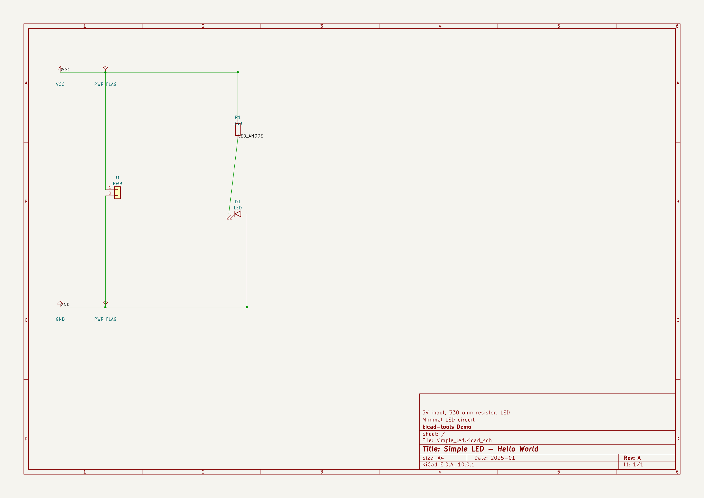
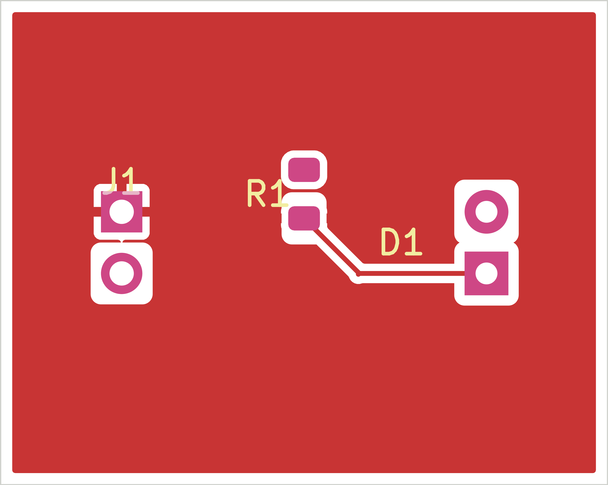
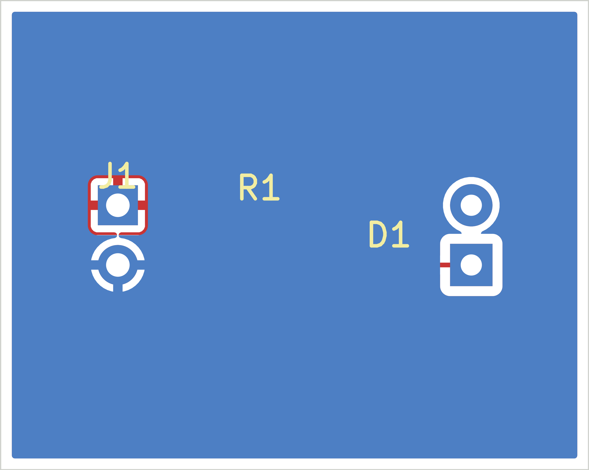
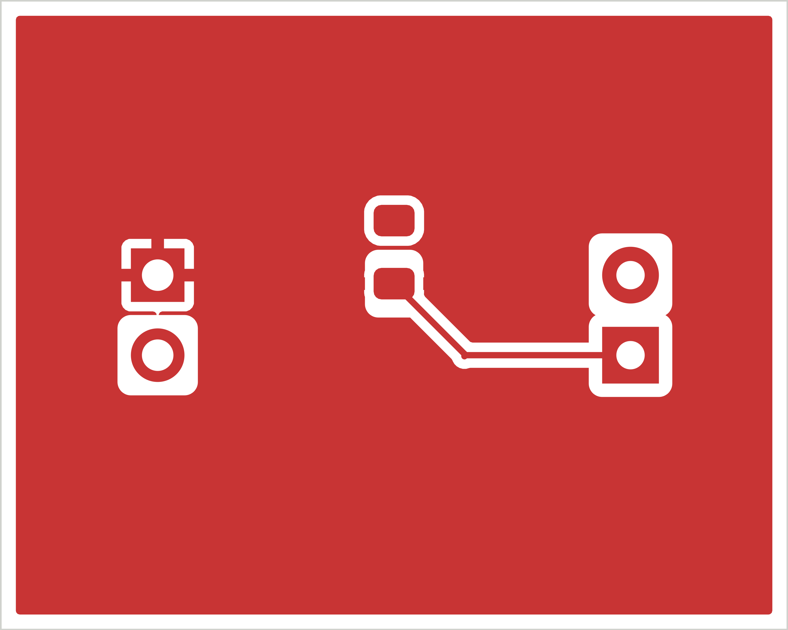
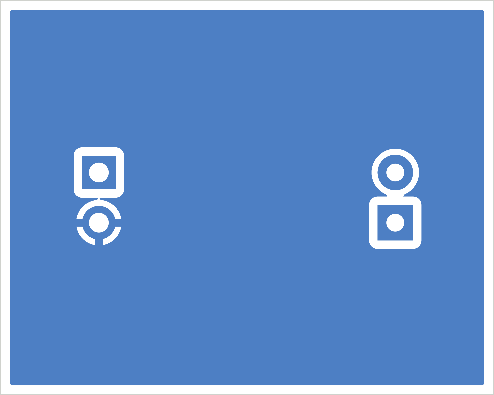

## Board Summary

| Property | Value |
|----------|-------|
| Layers | 2 copper (F.Cu, B.Cu) |
| Footprints | 3 (1 SMD, 2 THT, 0 other) |
| Nets | 3 |
| Traces | 4 segments |
| Vias | 0 |
| Board Size | 25.0 x 20.0 mm |

## Design Overview

### Theory of Operation

Simple LED - Hello World

Minimal LED circuit

5V input, 330 ohm resistor, LED

### Power Architecture

**Power Rails**: GND, PWR_FLAG, VCC

## Assembly Notes

1 polarized component

- **Polarized components**: 1 -- check orientation markings

## ERC Status

| Metric | Count |
|--------|-------|
| Errors | 0 |
| Warnings | 0 |

**Status**: SKIPPED -- ERC skipped by user request

\newpage

## Schematic Overview

### Schematic: simple_led

\newpage

## PCB Layout

### Copper

### Assembly

\newpage

## Copper Layers

### F.Cu

### B.Cu

\newpage

## Bill of Materials

| Value | Package | Qty | References |
|-------|---------|-----|------------|
| LED | LED_D5.0mm | 1 | D1 |
| PWR | PinHeader_1x02_P2.54mm_Vertical | 1 | J1 |
| 330 | R_0805_2012Metric | 1 | R1 |

\newpage

## DRC Status

| Metric | Count |
|--------|-------|
| Errors | 0 |
| Warnings | 0 |
| Blocking | 0 |

**Status**: PASS

\newpage

## Manufacturing Readiness

**Verdict**: READY

### Action Items

- **[OPTIONAL]** Verify zone fill in KiCad for 2 zone-connected nets

\newpage

## Routing Status

| Metric | Value |
|--------|-------|
| Signal Net Completion | 100.0% (1/1) |
| Overall Completion | 100.0% |
| Complete Nets | 3 / 3 |
| Zone-Connected Nets | 2 |
| Incomplete Nets | 0 |
| Unconnected Pads | 0 |

### Zone-Connected Nets

- GND
- VCC

## Cost Estimate

| Metric | Per Board (estimated) |
|--------|-------|
| PCB Fabrication | ~0.5 USD |
| Components (estimated) | ~0.12 USD |
| Assembly (estimated) | ~1.92 USD |
| **Total (estimated)** | **~2.55 USD** |
| Batch Quantity | 5 |
| Batch Total (estimated) | ~12.73 USD |

