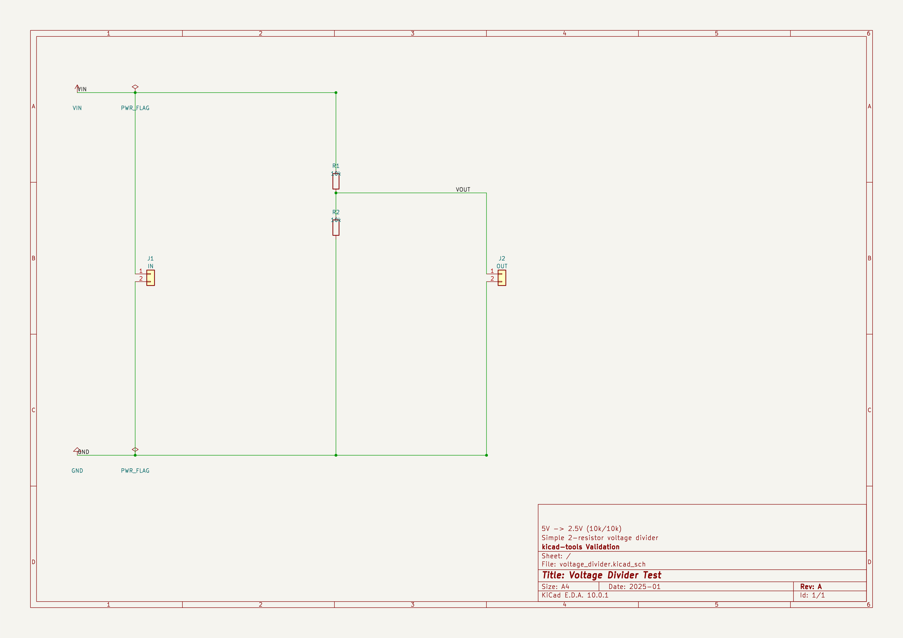
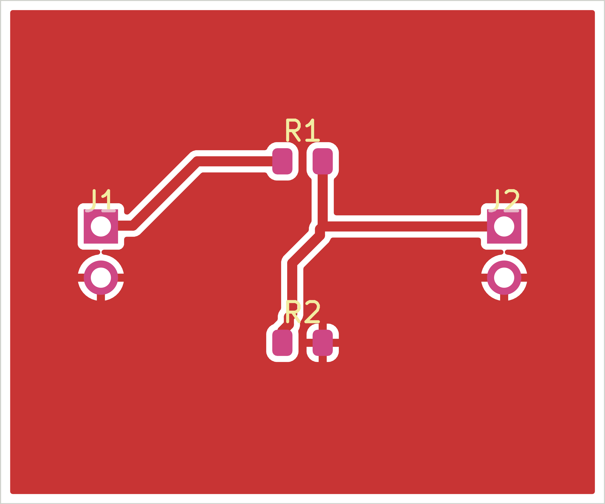
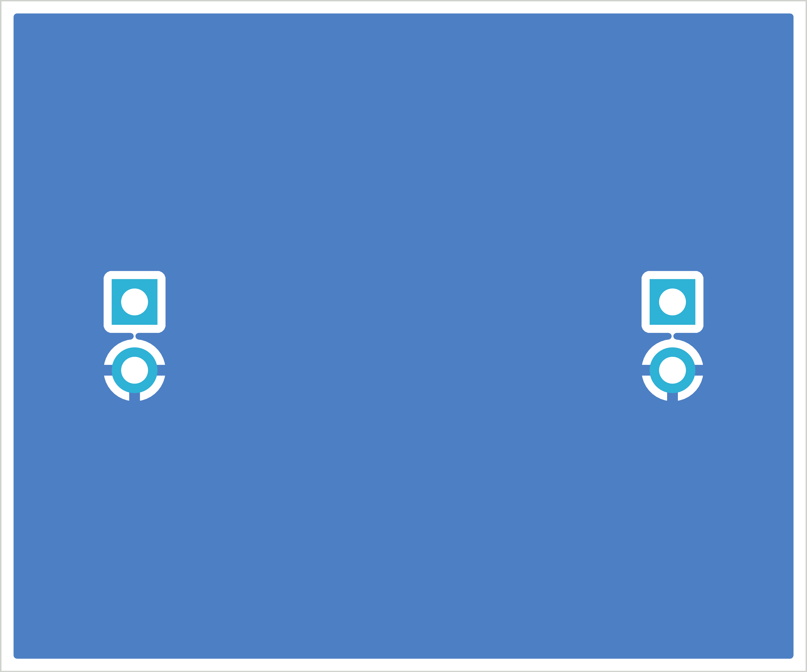
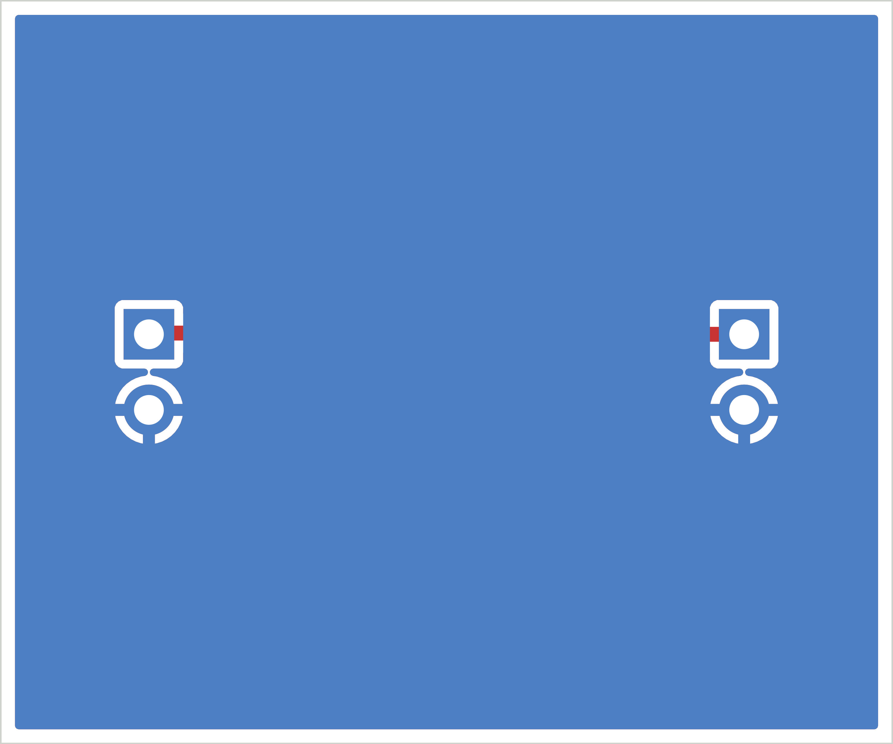
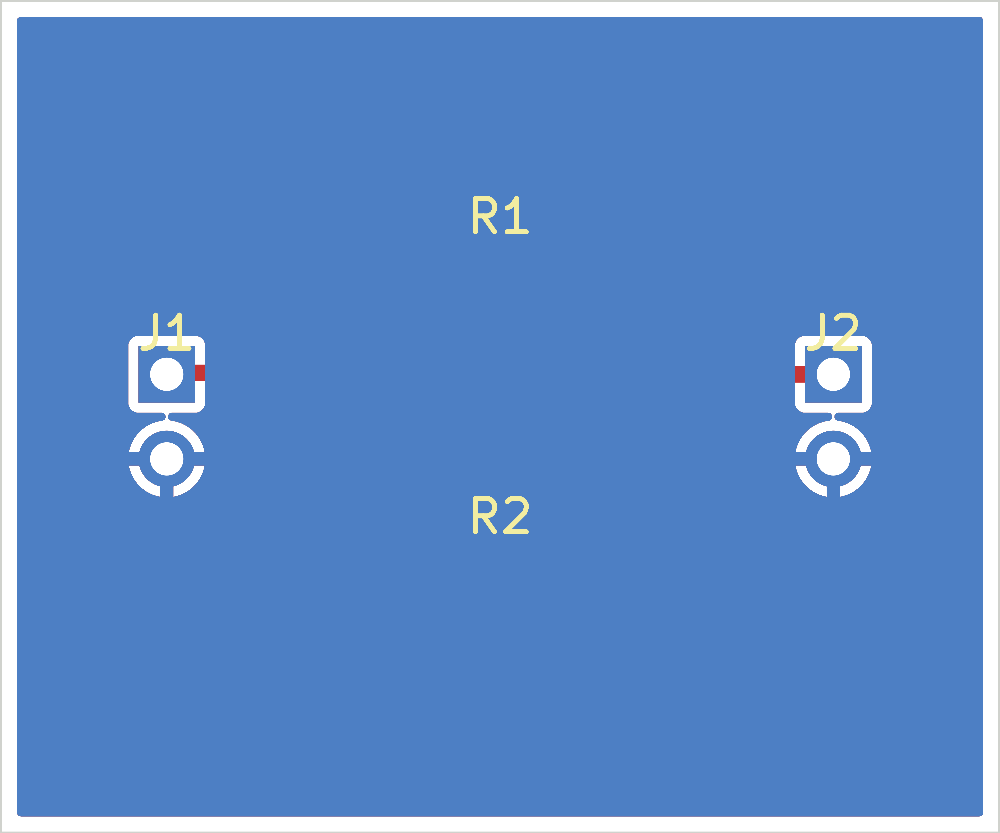
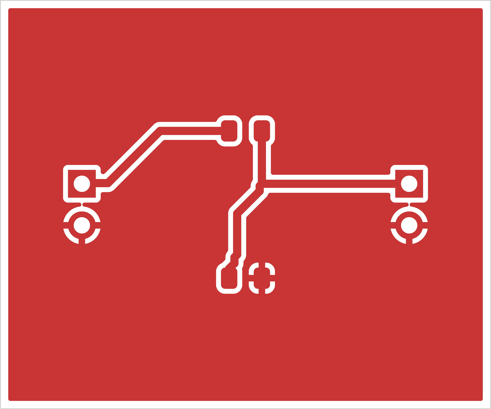
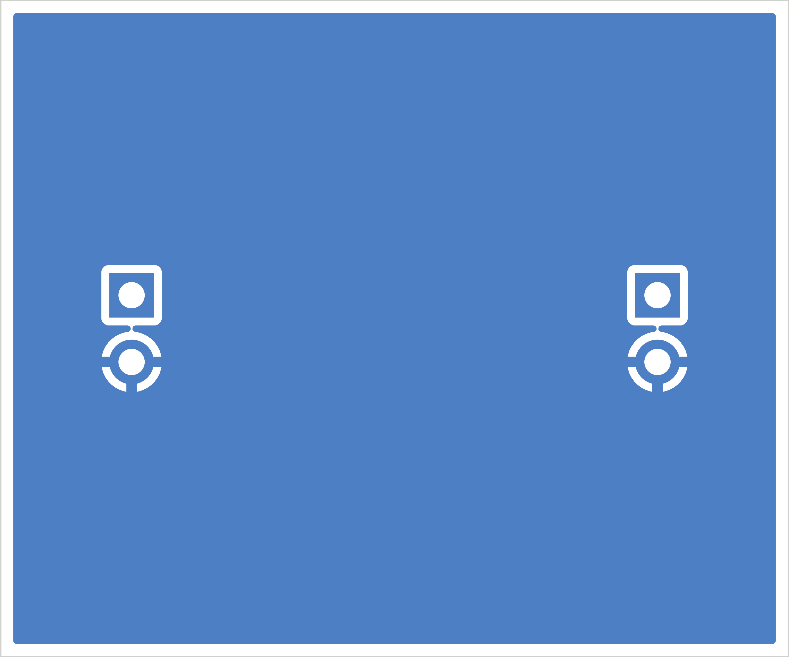

## Board Summary

| Property | Value |
|----------|-------|
| Layers | 2 copper (F.Cu, B.Cu) |
| Footprints | 4 (2 SMD, 2 THT, 0 other) |
| Nets | 3 |
| Traces | 15 segments |
| Vias | 0 |
| Board Size | 30.0 x 25.0 mm |

## Design Overview

### Theory of Operation

Voltage Divider Test

Simple 2-resistor voltage divider

5V -> 2.5V (10k/10k)

### Power Architecture

**Power Rails**: GND, PWR_FLAG

## ERC Status

| Metric | Count |
|--------|-------|
| Errors | 0 |
| Warnings | 0 |

**Status**: SKIPPED -- ERC skipped by user request

\newpage

## Schematic Overview

### Schematic: voltage_divider

\newpage

## PCB Layout

### Copper

### Assembly

\newpage

## Copper Layers

### F.Cu

### B.Cu

\newpage

## Bill of Materials

| Value | Package | Qty | References |
|-------|---------|-----|------------|
| IN | PinHeader_1x02_P2.54mm_Vertical | 1 | J1 |
| OUT | PinHeader_1x02_P2.54mm_Vertical | 1 | J2 |
| 10k | R_0805_2012Metric | 2 | R1, R2 |

\newpage

## DRC Status

| Metric | Count |
|--------|-------|
| Errors | 0 |
| Warnings | 0 |
| Blocking | 0 |

**Status**: PASS

\newpage

## Manufacturing Readiness

**Verdict**: READY

### Action Items

- **[OPTIONAL]** Verify zone fill in KiCad for 1 zone-connected nets

\newpage

## Routing Status

| Metric | Value |
|--------|-------|
| Signal Net Completion | 100.0% (2/2) |
| Overall Completion | 100.0% |
| Complete Nets | 3 / 3 |
| Zone-Connected Nets | 1 |
| Incomplete Nets | 0 |
| Unconnected Pads | 0 |

### Zone-Connected Nets

- GND

## Cost Estimate

| Metric | Per Board (estimated) |
|--------|-------|
| PCB Fabrication | ~0.55 USD |
| Components (estimated) | ~0.21 USD |
| Assembly (estimated) | ~1.93 USD |
| **Total (estimated)** | **~2.69 USD** |
| Batch Quantity | 5 |
| Batch Total (estimated) | ~13.44 USD |

