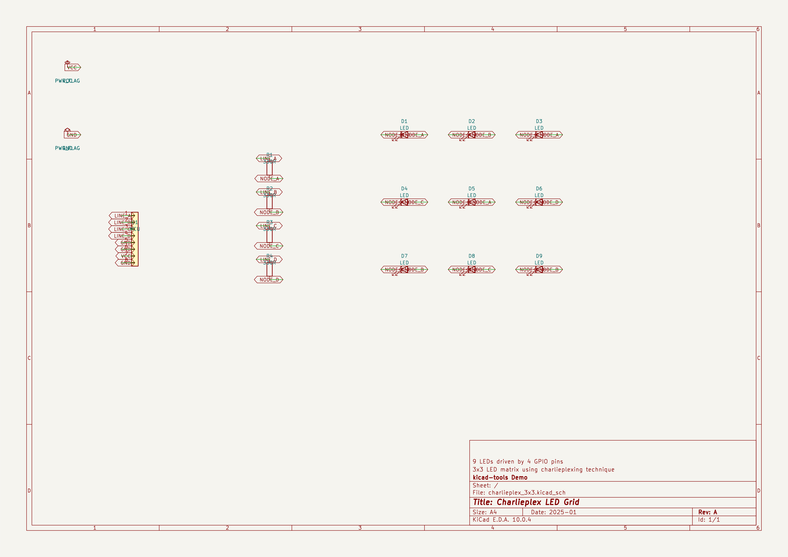
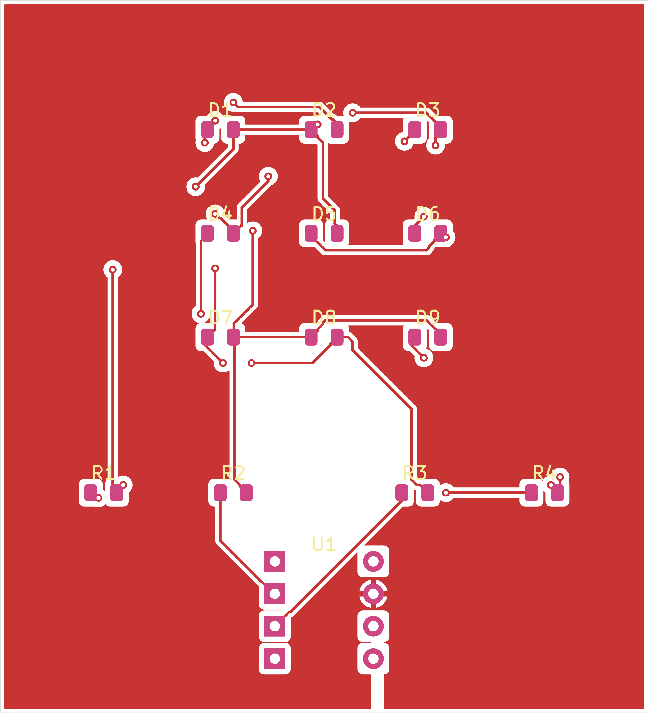
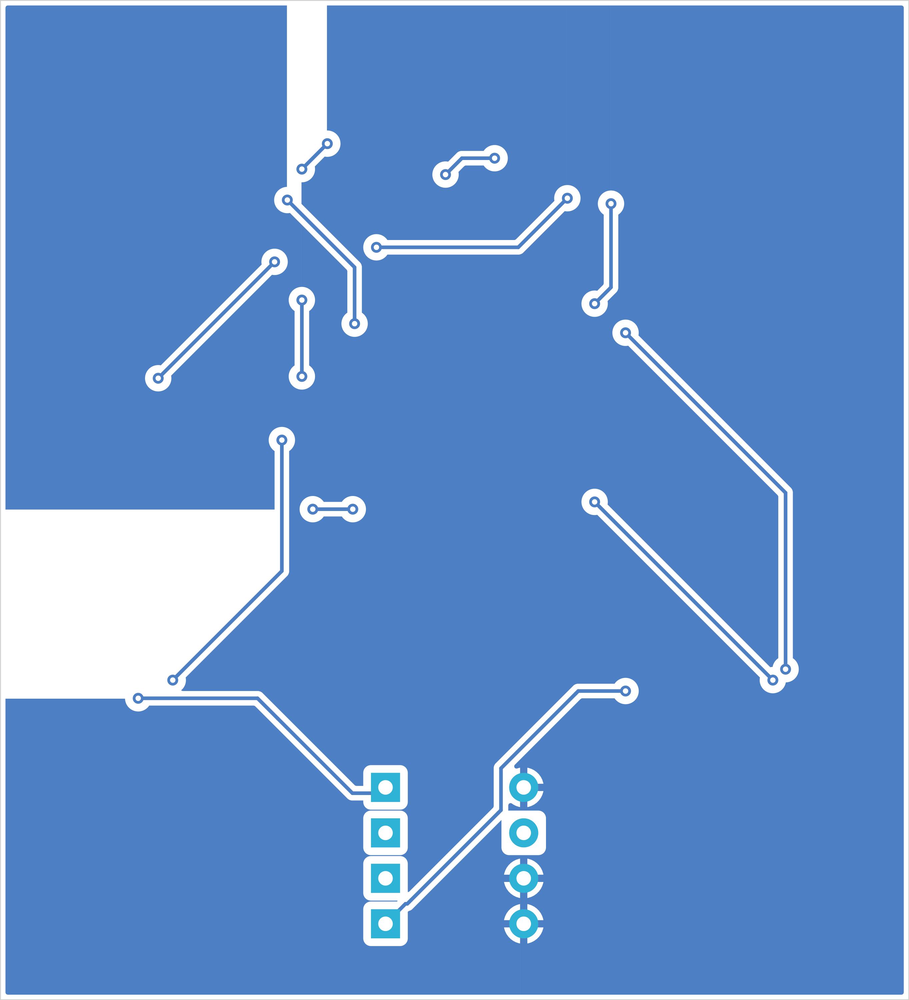
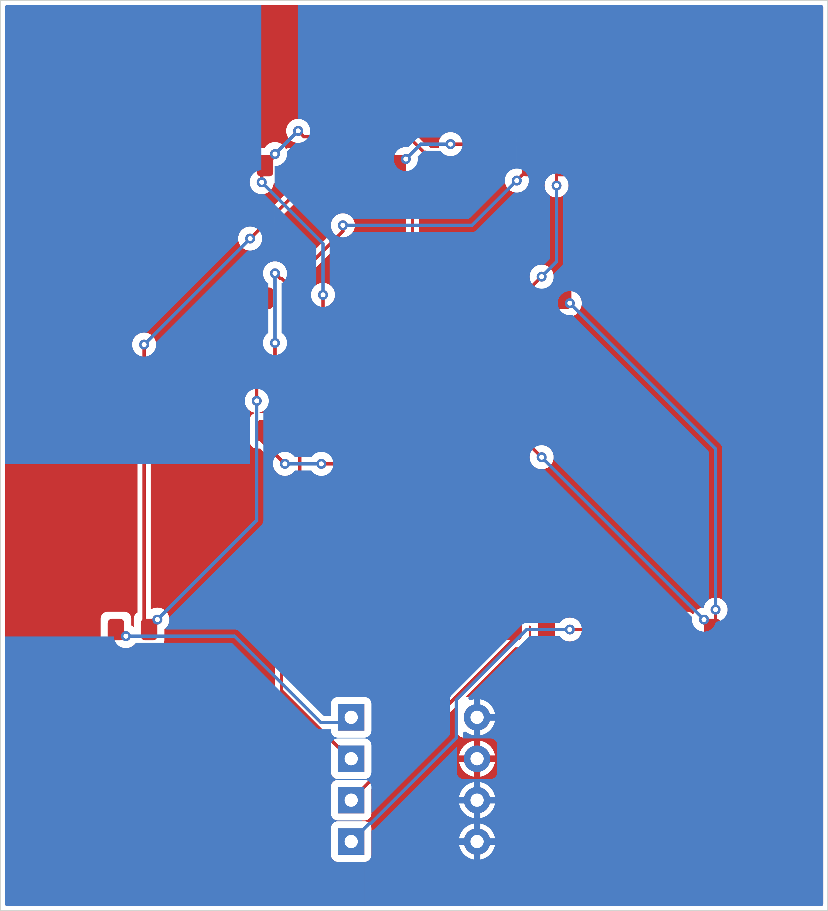
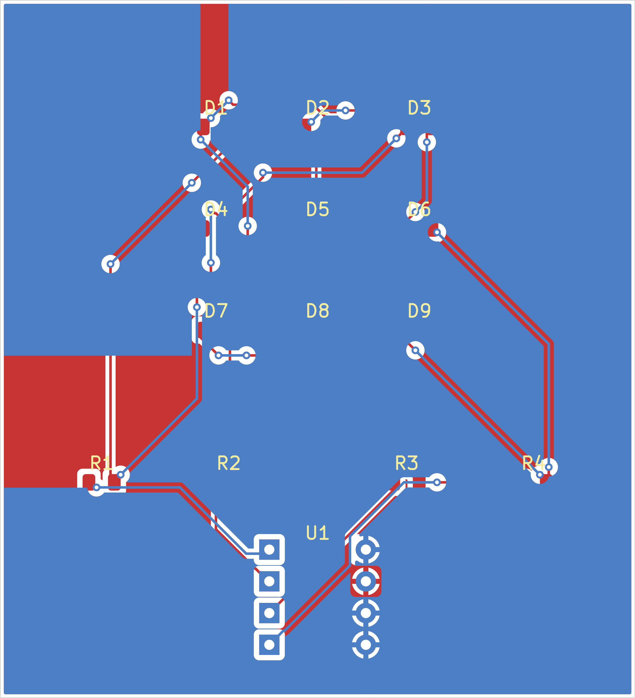
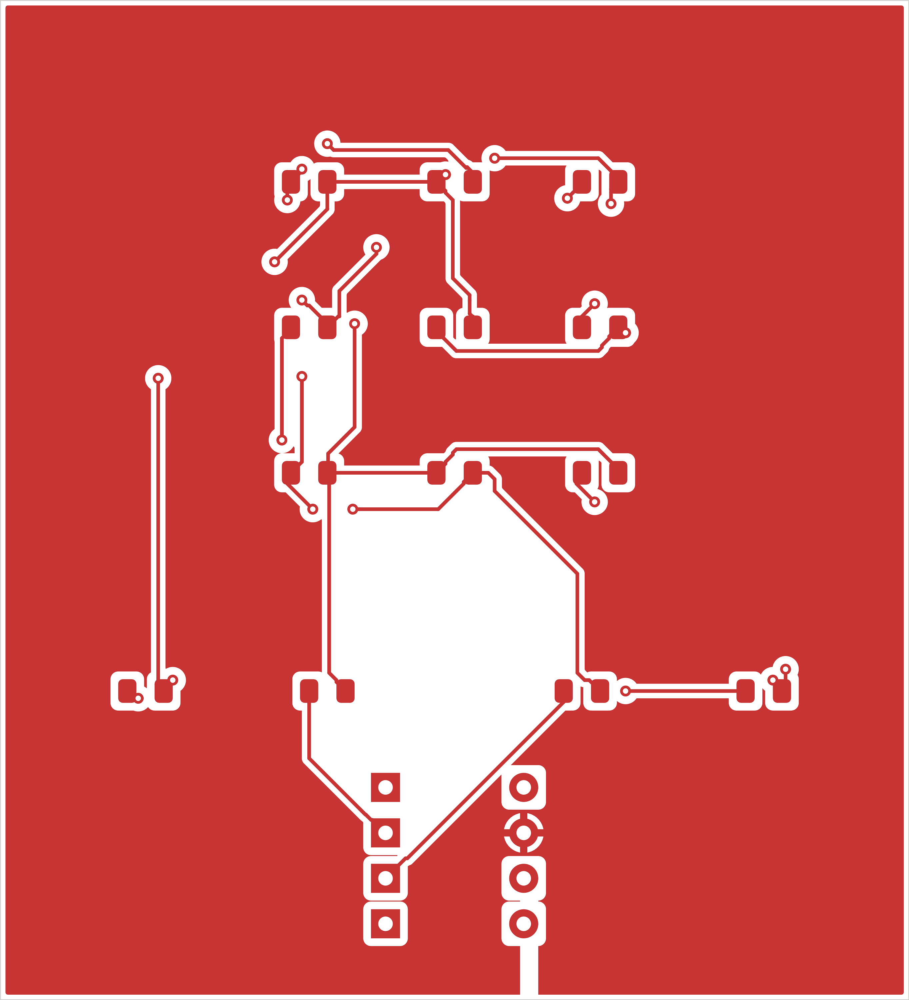
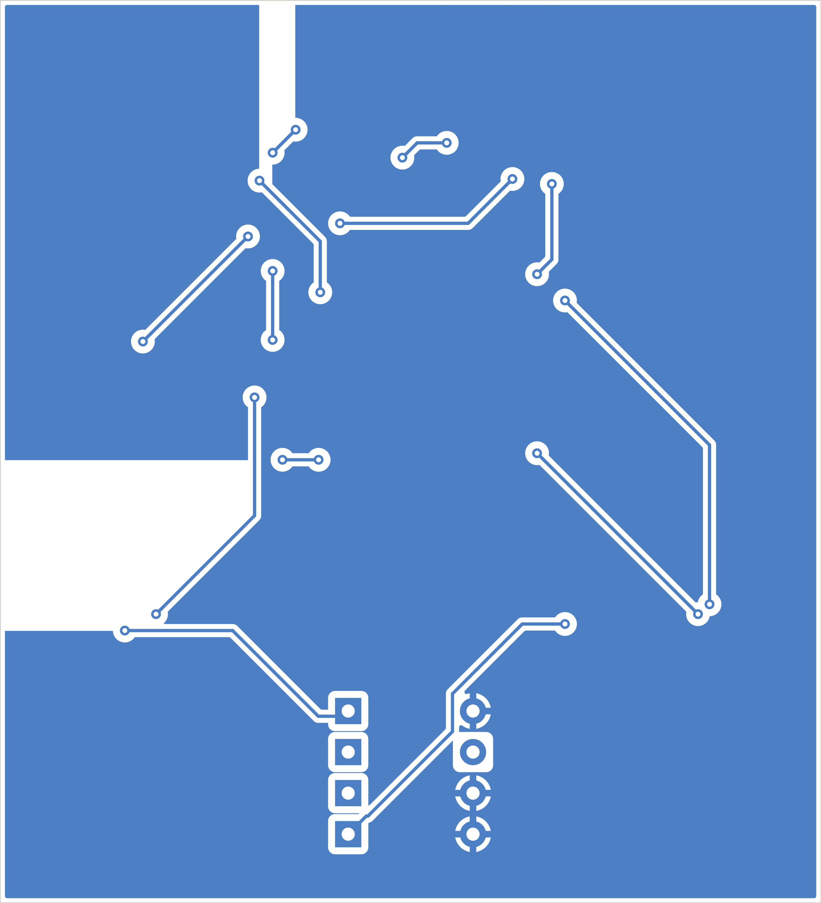

## Board Summary

| Property | Value |
|----------|-------|
| Layers | 2 copper (F.Cu, B.Cu) |
| Footprints | 14 (13 SMD, 1 THT, 0 other) |
| Nets | 10 |
| Traces | 197 segments |
| Vias | 24 |
| Board Size | 50.0 x 55.0 mm |

## Design Overview

### Theory of Operation

Charlieplex LED Grid

3x3 LED matrix using charlieplexing technique

9 LEDs driven by 4 GPIO pins

### Power Architecture

**Power Rails**: GND, PWR_FLAG, VCC

## Assembly Notes

9 polarized components

- **Polarized components**: 9 -- check orientation markings

## ERC Status

| Metric | Count |
|--------|-------|
| Errors | 0 |
| Warnings | 0 |

**Status**: SKIPPED -- ERC skipped by user request

\newpage

## Schematic Overview

### Schematic: charlieplex_3x3

\newpage

## PCB Layout

### Copper

### Assembly

\newpage

## Copper Layers

### F.Cu

### B.Cu

\newpage

## Bill of Materials

| Value | Package | Qty | References |
|-------|---------|-----|------------|
| LED | LED_0805_2012Metric | 9 | D1, D2, D3, D4, D5, D6, D7, D8, D9 |
| 330R | R_0805_2012Metric | 4 | R1, R2, R3, R4 |
| MCU | DIP-8_W7.62mm | 1 | U1 |

\newpage

## DRC Status

| Metric | Count |
|--------|-------|
| Errors | 0 |
| Warnings | 6 |
| Blocking | 0 |

**Status**: PASS
### Violations by Type

| Violation Type | Count |
|----------------|-------|
| copper_sliver | 6 |

\newpage

## Manufacturing Readiness

**Verdict**: WARNING

### Action Items

- **[OPTIONAL]** Verify zone fill in KiCad for 1 zone-connected nets
- **[OPTIONAL]** Review 6 DRC warnings
- **[OPTIONAL]** Analog net: LINE_A — audio signal; keep short, away from digital/switching nets
- **[OPTIONAL]** Analog net: LINE_B — audio signal; keep short, away from digital/switching nets
- **[OPTIONAL]** Analog net: LINE_C — audio signal; keep short, away from digital/switching nets
- **[OPTIONAL]** Analog net: LINE_D — audio signal; keep short, away from digital/switching nets

\newpage

## Routing Status

| Metric | Value |
|--------|-------|
| Signal Net Completion | 100.0% (8/8) |
| Overall Completion | 100.0% |
| Complete Nets | 10 / 10 |
| Zone-Connected Nets | 2 |
| Single-Pad Nets | 1 (no routing needed) |
| Incomplete Nets | 0 |
| Unconnected Pads | 0 |

### Zone-Connected Nets

- GND
- VCC

### Single-Pad Nets

1 single-pad net (no routing needed) -- not listed individually.

## Cost Estimate

| Metric | Per Board (estimated) |
|--------|-------|
| PCB Fabrication | ~0.95 USD |
| Components (estimated) | ~0.56 USD |
| Assembly (estimated) | ~2.01 USD |
| **Total (estimated)** | **~3.52 USD** |
| Batch Quantity | 5 |
| Batch Total (estimated) | ~17.62 USD |

