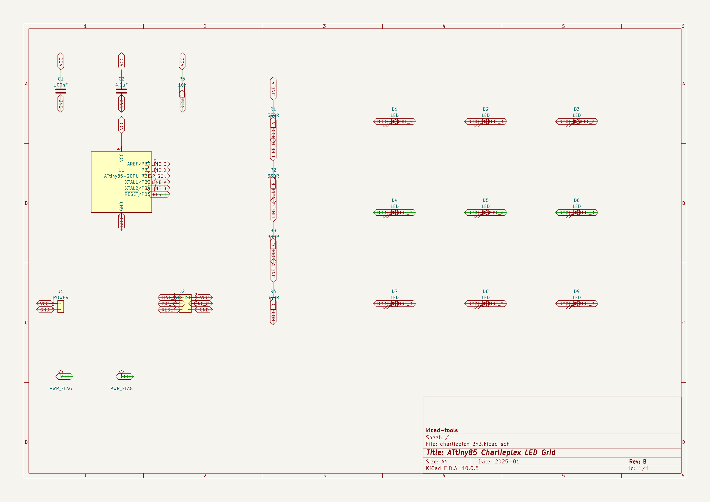
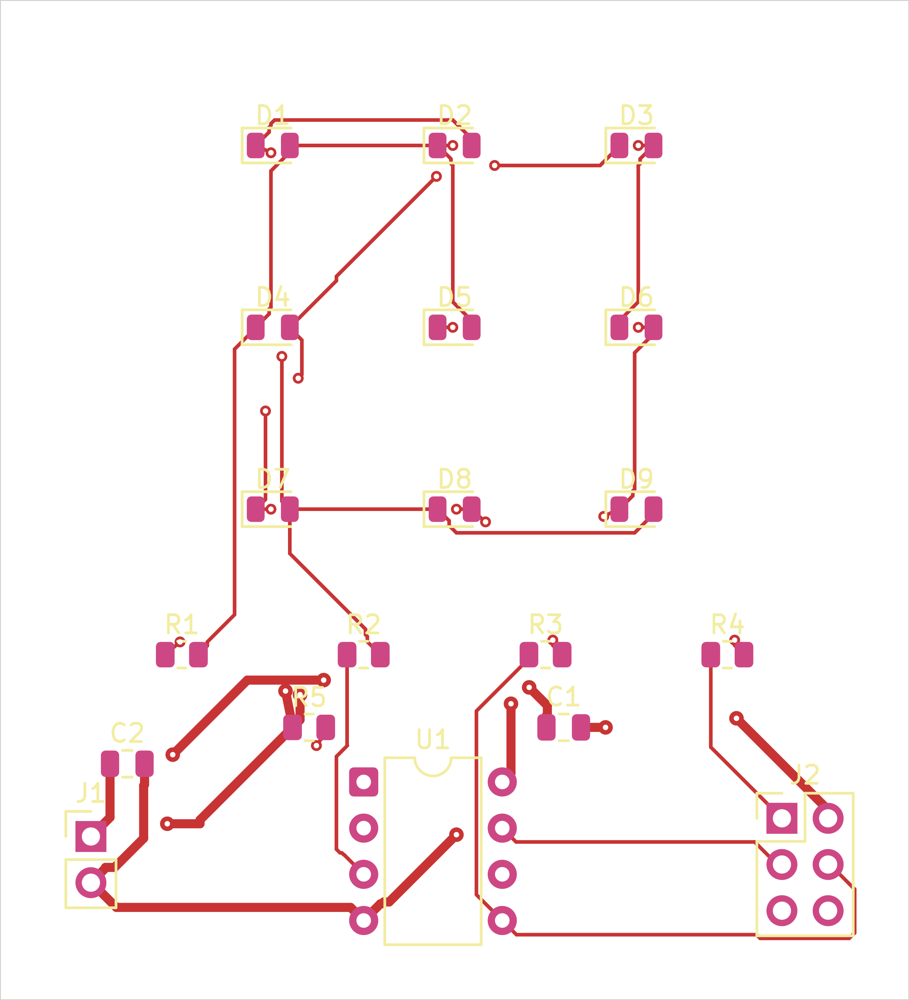
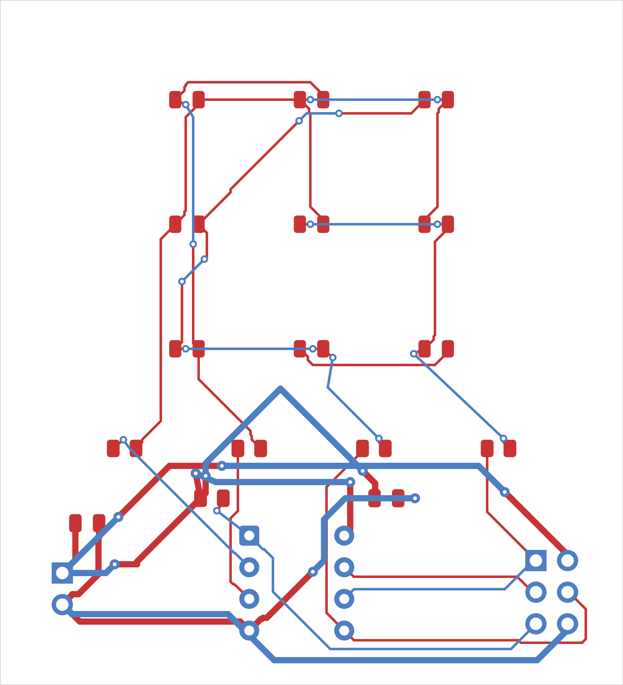
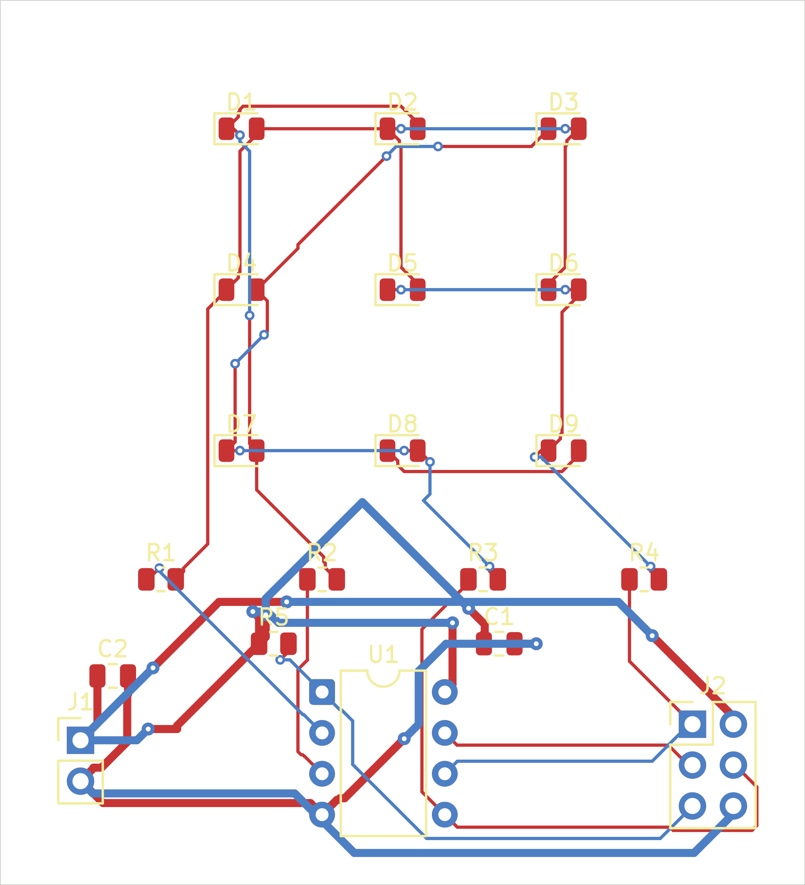
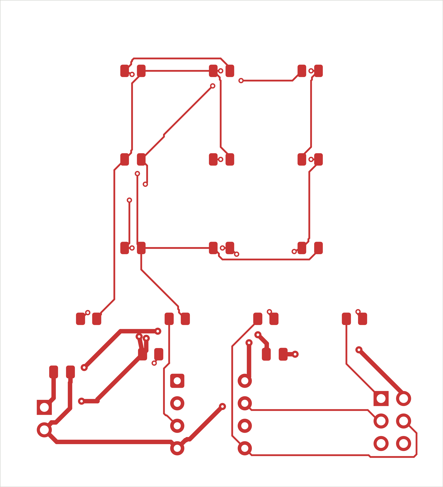
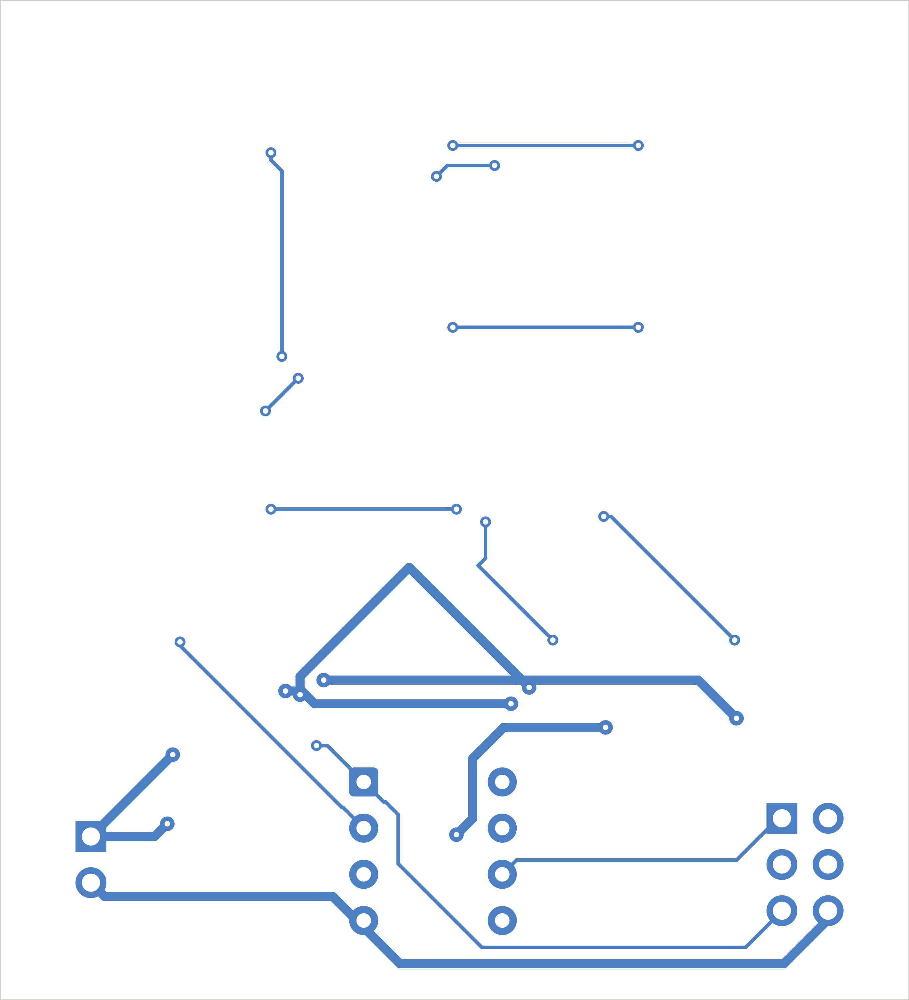

## Board Summary

| Property | Value |
|----------|-------|
| Layers | 2 copper (F.Cu, B.Cu) |
| Footprints | 19 (16 SMD, 3 THT, 0 other) |
| Nets | 12 |
| Traces | 440 segments |
| Vias | 28 |
| Board Size | 50.0 x 55.0 mm |

## Design Overview

### Theory of Operation

ATtiny85 Charlieplex LED Grid

### Power Architecture

**Power Rails**: PWR_FLAG

## Assembly Notes

9 polarized components

- **Polarized components**: 9 -- check orientation markings

## Hand-Solder (THT) Components

The following 3 through-hole components are **excluded from the SMT pick-and-place file** and must be hand-soldered (or wave/selective-soldered) after SMT assembly. They appear in the BOM for sourcing.

| Value | Package | Qty | References |
|-------|---------|-----|------------|
| POWER | PinHeader_1x02_P2.54mm_Vertical | 1 | J1 |
| AVR-ISP | PinHeader_2x03_P2.54mm_Vertical | 1 | J2 |
| ATtiny85-20PU | DIP-8_W7.62mm | 1 | U1 |

## ERC Status

| Metric | Count |
|--------|-------|
| Errors | 0 |
| Warnings | 0 |

**Status**: SKIPPED -- ERC skipped by user request

\newpage

## Schematic Overview

### Schematic: charlieplex_3x3

\newpage

## PCB Layout

### Copper

### Assembly

\newpage

## Copper Layers

### F.Cu

### B.Cu

\newpage

## Bill of Materials

| Value | Package | Qty | References |
|-------|---------|-----|------------|
| 100nF | C_0805_2012Metric | 1 | C1 |
| 4.7uF | C_0805_2012Metric | 1 | C2 |
| LED | LED_0805_2012Metric | 9 | D1, D2, D3, D4, D5, D6, D7, D8, D9 |
| AVR-ISP | PinHeader_2x03_P2.54mm_Vertical | 1 | J2 |
| POWER | PinHeader_1x02_P2.54mm_Vertical | 1 | J1 |
| 10k | R_0805_2012Metric | 1 | R5 |
| 330R | R_0805_2012Metric | 4 | R1, R2, R3, R4 |
| ATtiny85-20PU | DIP-8_W7.62mm | 1 | U1 |

\newpage

## DRC Status

| Metric | Count |
|--------|-------|
| Errors | 0 |
| Warnings | 0 |
| Blocking | 0 |

**Status**: PASS

\newpage

## Manufacturing Readiness

**Verdict**: READY

### Action Items

- **[OPTIONAL]** Analog net: LINE_A — audio signal; keep short, away from digital/switching nets
- **[OPTIONAL]** Analog net: LINE_B — audio signal; keep short, away from digital/switching nets
- **[OPTIONAL]** Analog net: LINE_C — audio signal; keep short, away from digital/switching nets
- **[OPTIONAL]** Analog net: LINE_D — audio signal; keep short, away from digital/switching nets

\newpage

## Routing Status

| Metric | Value |
|--------|-------|
| Signal Net Completion | 100.0% (12/12) |
| Overall Completion | 100.0% |
| Complete Nets | 12 / 12 |
| Incomplete Nets | 0 |
| Unconnected Pads | 0 |

## Cost Estimate

| Metric | Per Board (estimated) |
|--------|-------|
| PCB Fabrication | ~0.95 USD |
| Components (estimated) | ~0.78 USD |
| Assembly (estimated) | ~2.04 USD |
| **Total (estimated)** | **~3.77 USD** |
| Batch Quantity | 5 |
| Batch Total (estimated) | ~18.86 USD |

