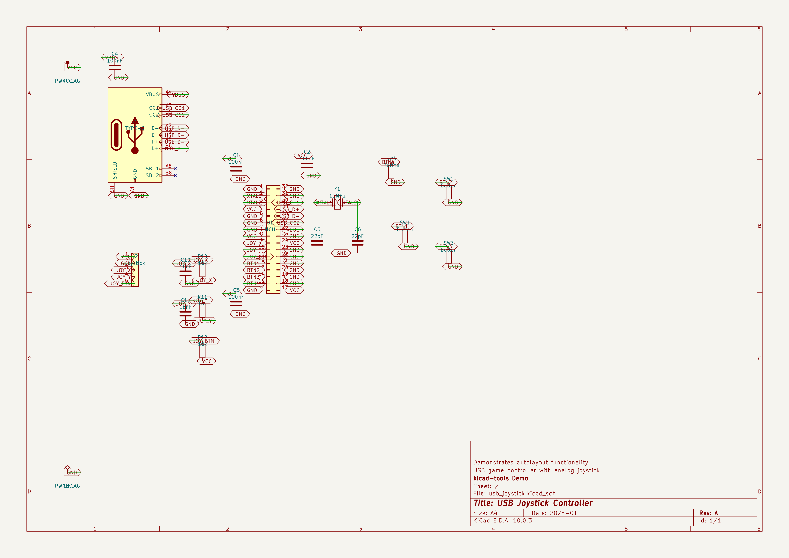
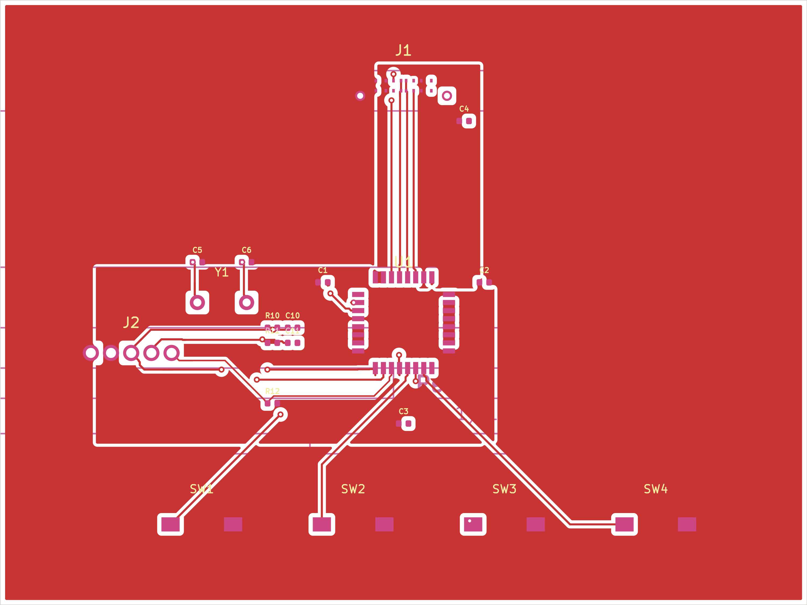
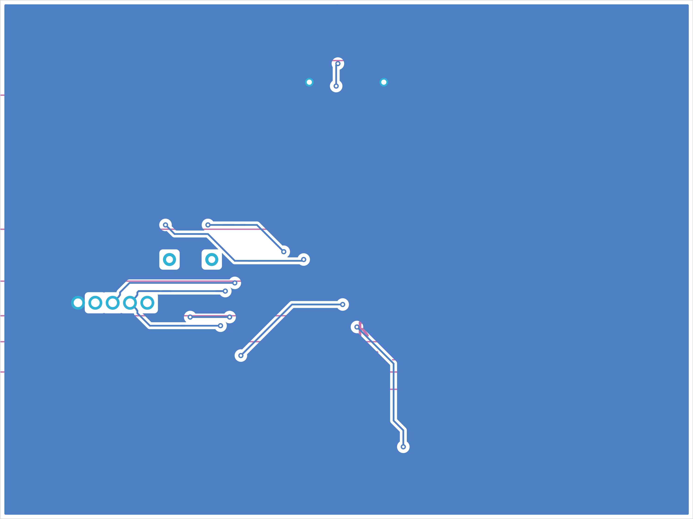
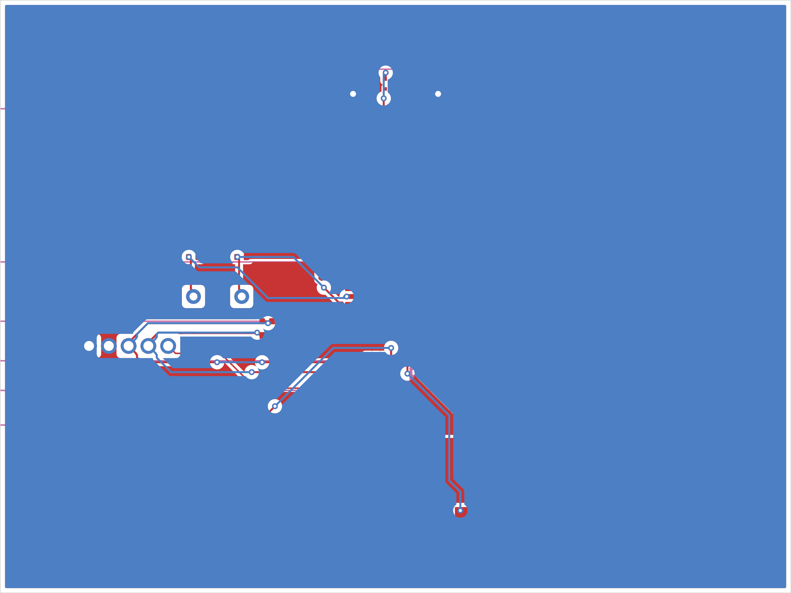
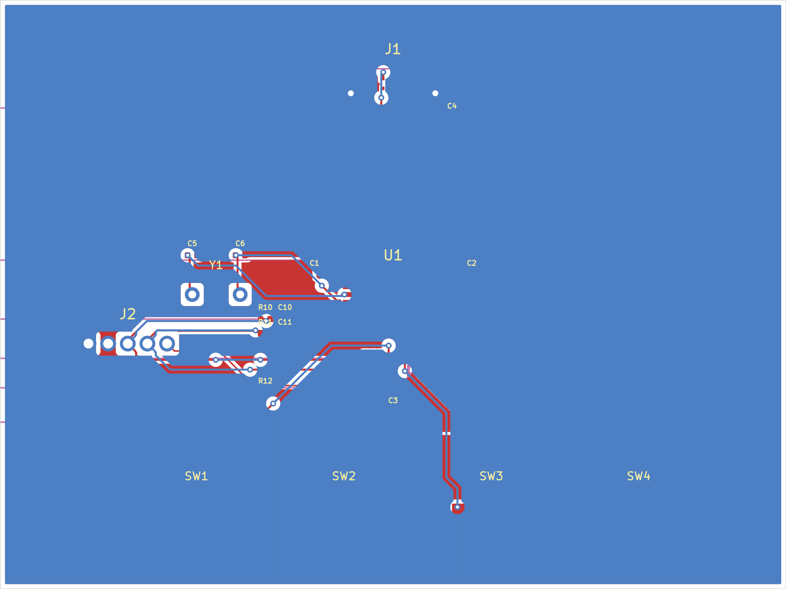
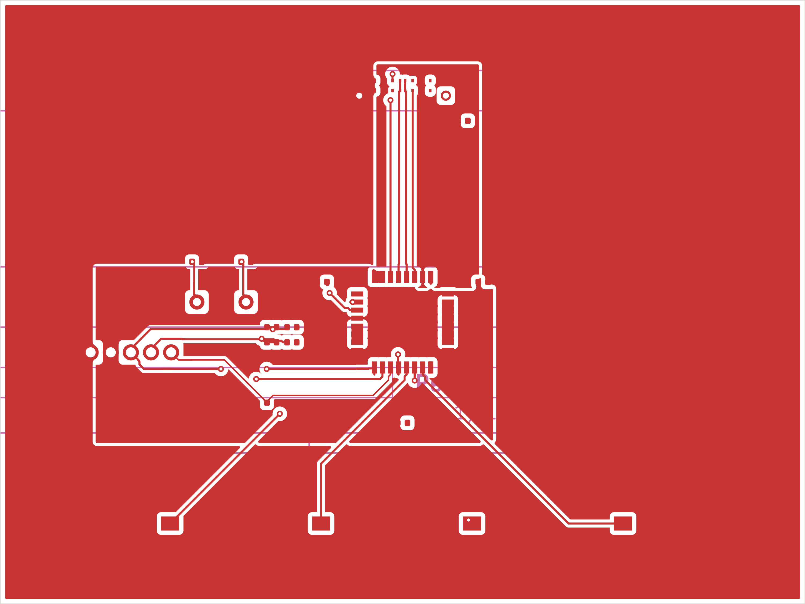
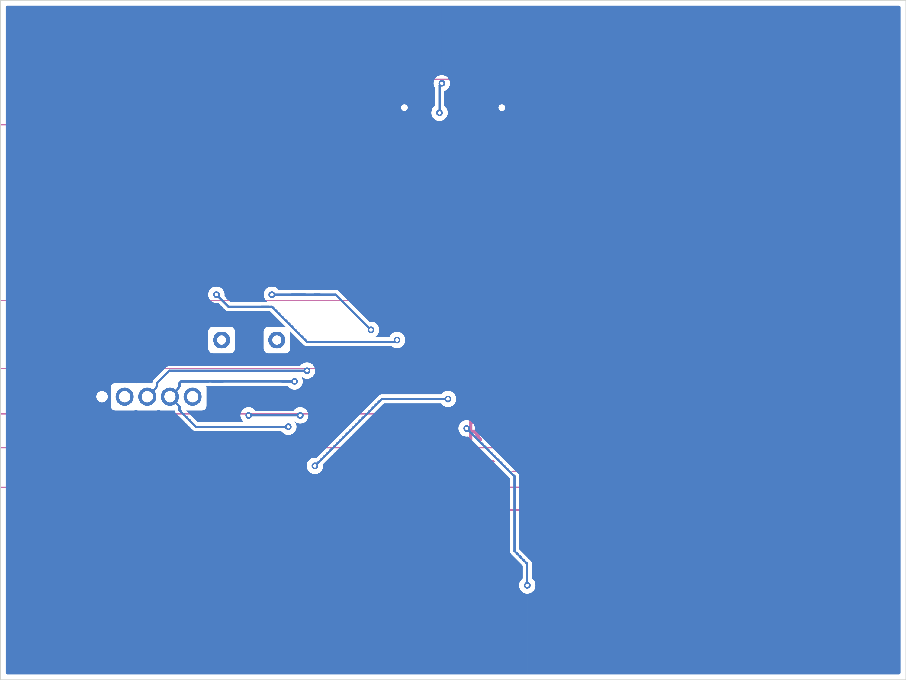

## Board Summary

| Property | Value |
|----------|-------|
| Layers | 2 copper (F.Cu, B.Cu) |
| Footprints | 19 (17 SMD, 2 THT, 0 other) |
| Nets | 16 |
| Traces | 582 segments |
| Vias | 15 |
| Board Size | 80.0 x 60.0 mm |

## Design Overview

### Theory of Operation

USB Joystick Controller

USB game controller with analog joystick

Demonstrates autolayout functionality

### Communication Interfaces

| Protocol | Signals |
|----------|---------|
| USB | USB_D+, USB_D- |

### Power Architecture

**Power Rails**: +5V, GND, PWR_FLAG

## Assembly Notes

1 fine-pitch component

- **Fine-pitch components**: 1 (U1)

## Hand-Solder (THT) Components

The following 1 through-hole component is **excluded from the SMT pick-and-place file** and must be hand-soldered (or wave/selective-soldered) after SMT assembly. It appears in the BOM for sourcing.

| Value | Package | Qty | References |
|-------|---------|-----|------------|
| Joystick | Joystick_Analog | 1 | J2 |

## ERC Status

| Metric | Count |
|--------|-------|
| Errors | 0 |
| Warnings | 0 |

**Status**: SKIPPED -- ERC skipped by user request

\newpage

## Schematic Overview

### Schematic: usb_joystick

\newpage

## PCB Layout

### Copper

### Assembly

\newpage

## Copper Layers

### F.Cu

### B.Cu

\newpage

## Bill of Materials

| Value | Package | Qty | References |
|-------|---------|-----|------------|
| 100nF | C_0402_1005Metric | 4 | C1, C2, C3, C4 |
| 16nF | C_0402_1005Metric | 2 | C10, C11 |
| 22pF | C_0402_1005Metric | 2 | C5, C6 |
| Joystick | Joystick_Analog | 1 | J2 |
| TYPE-C | USB_C_Receptacle_GCT_USB4105 | 1 | J1 |
| 10k | R_0402_1005Metric | 3 | R10, R11, R12 |
| Button | SW_SPST_TL3342 | 4 | SW1, SW2, SW3, SW4 |
| MCU | TQFP-32_7x7mm_P0.8mm | 1 | U1 |
| 16MHz | Crystal_HC49-U_Vertical | 1 | Y1 |

\newpage

## DRC Status

| Metric | Count |
|--------|-------|
| Errors | 0 |
| Warnings | 16 |
| Blocking | 0 |

**Status**: PASS
### Violations by Type

| Violation Type | Count |
|----------------|-------|
| silkscreen_text_height | 16 |

\newpage

## Manufacturing Readiness

**Verdict**: WARNING

### Action Items

- **[OPTIONAL]** Verify zone fill in KiCad for 3 zone-connected nets
- **[OPTIONAL]** Review 16 DRC warnings

\newpage

## Routing Status

| Metric | Value |
|--------|-------|
| Signal Net Completion | 100.0% (13/13) |
| Overall Completion | 100.0% |
| Complete Nets | 16 / 16 |
| Zone-Connected Nets | 3 |
| Incomplete Nets | 0 |
| Unconnected Pads | 0 |

### Zone-Connected Nets

- GND
- VBUS
- VCC

## Cost Estimate

| Metric | Per Board (estimated) |
|--------|-------|
| PCB Fabrication | ~1.36 USD |
| Components (estimated) | ~1.33 USD |
| Assembly (estimated) | ~2.03 USD |
| **Total (estimated)** | **~4.72 USD** |
| Batch Quantity | 5 |
| Batch Total (estimated) | ~23.61 USD |

