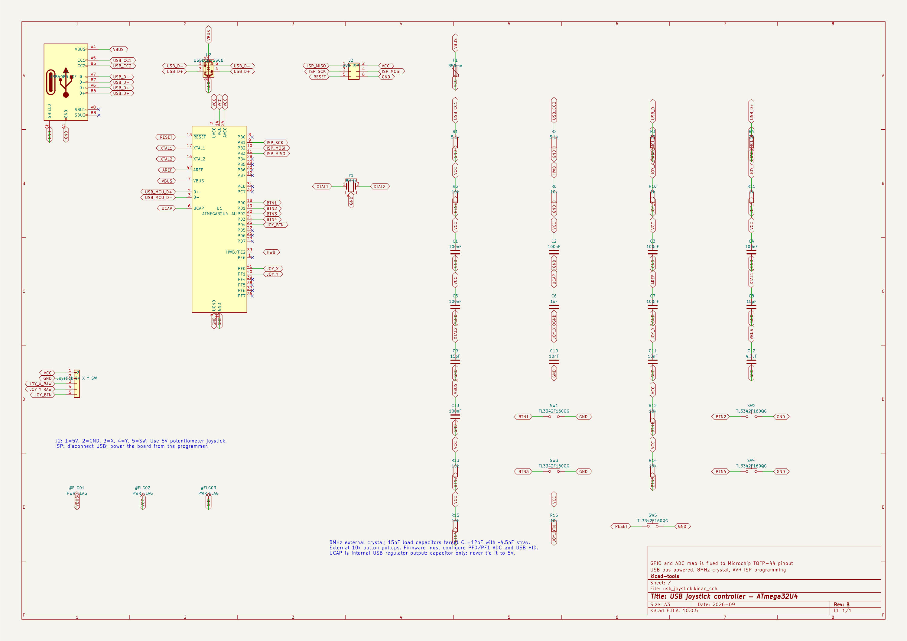
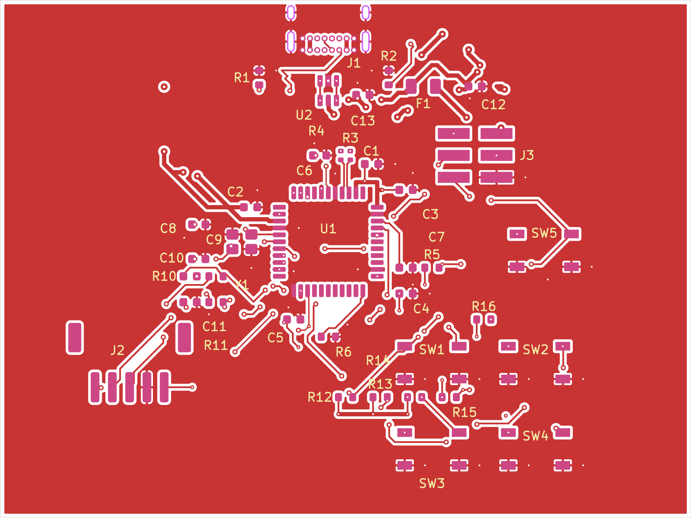
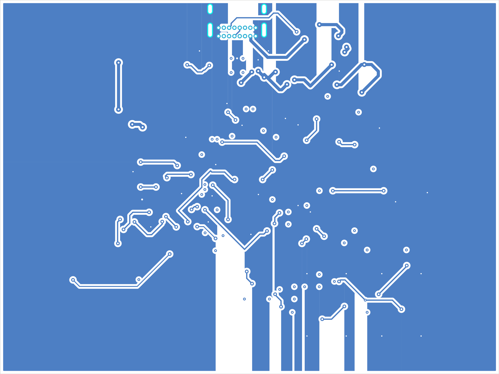
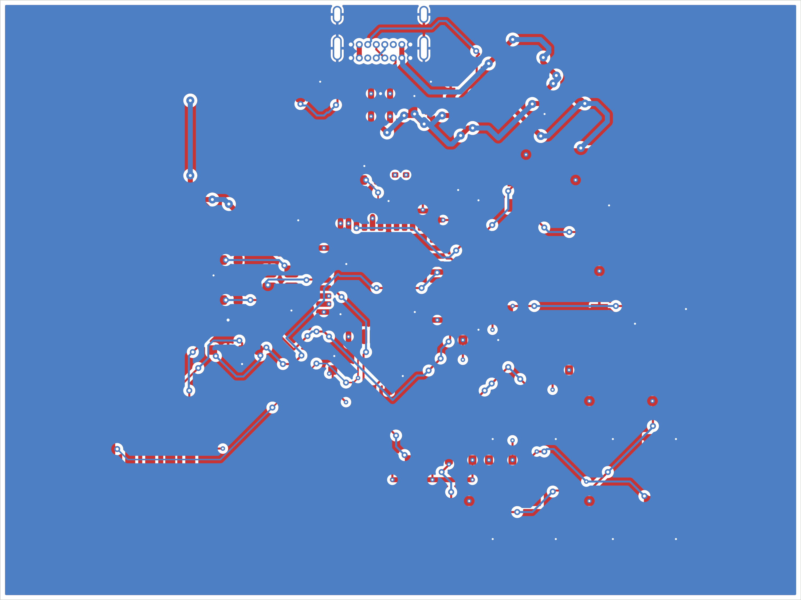
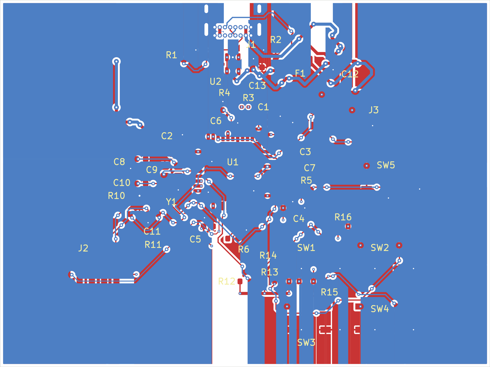
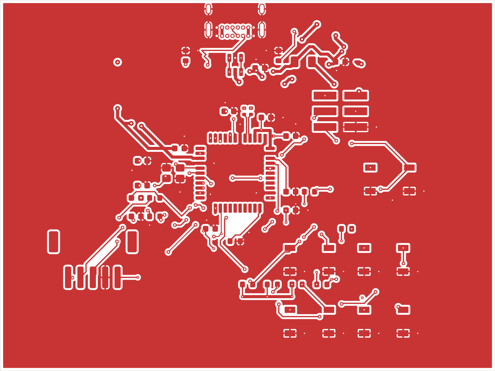
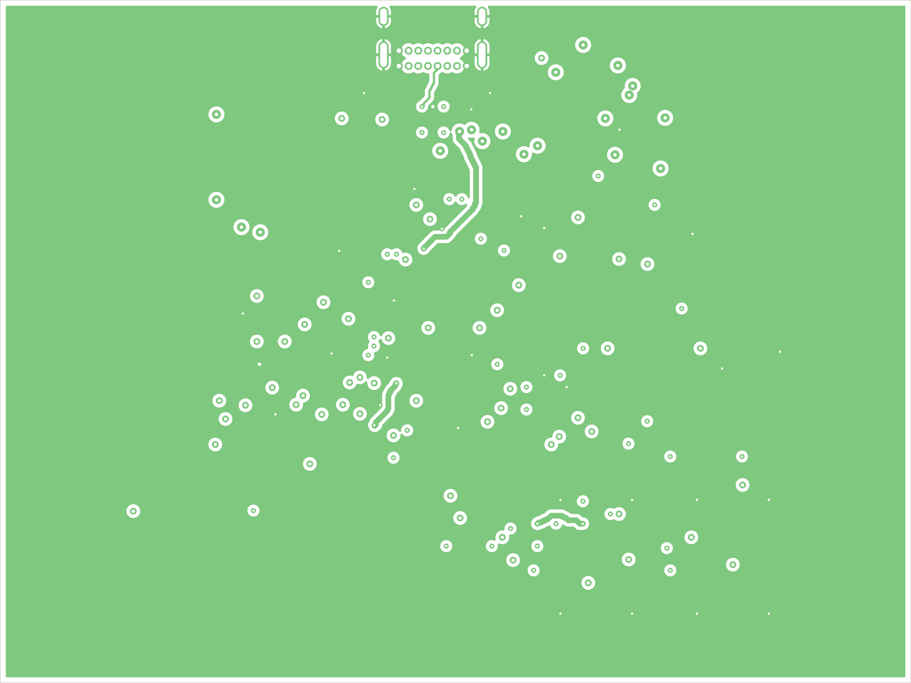
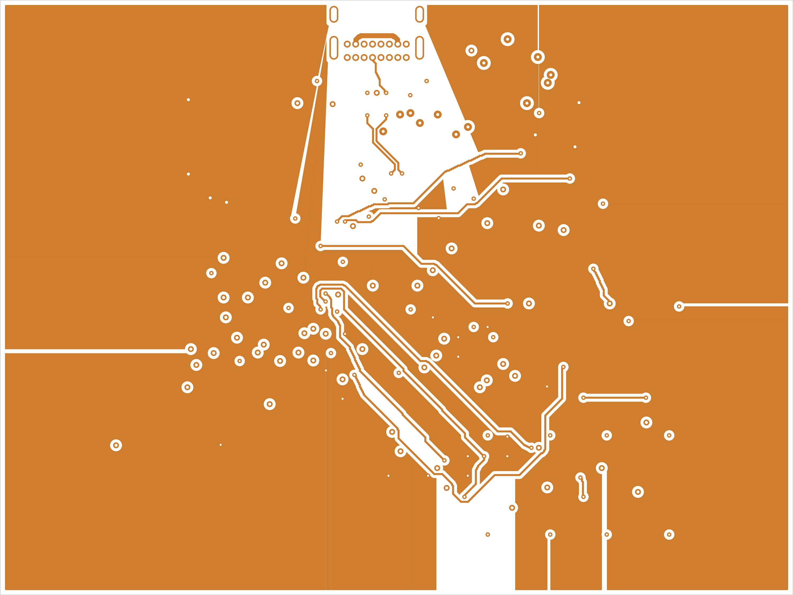

## Release Status: BLOCKED

This candidate is not qualified for manufacture. The saved copper has 12 native copper-sliver warnings and does not match independent bare native refill. The passing recipe replay and factory checks below do not clear these release blockers. See Manufacturing Readiness and the bundled `native-refill-comparison.json` for the measured discrepancy.

This report's release evidence was corrected against PR #5386 source `aa1fa691f545866a7754e28e1baf773e8cae31a8`. Measurements are retained KiCad 10.0.5 observations, not a new physical run. Board imagery, geometry and recipe remain unchanged.

## Board Summary

| Property | Value |
|----------|-------|
| Layers | 4 copper (F.Cu, In1.Cu, In2.Cu, B.Cu) |
| Footprints | 38 (37 SMD, 1 THT, 0 other) |
| Nets | 27 |
| Traces | 2050 segments |
| Vias | 153 |
| Board Size | 80.0 x 60.0 mm |

## Stackup

| Layer | Type | Thickness (mm) | Material |
|-------|------|----------------|----------|
| F.Cu | copper | 0.035 | -- |
| dielectric 1 | prepreg | 0.2104 | 7628 |
| In1.Cu | copper | 0.0152 | -- |
| dielectric 2 | core | 1.065 | FR4 |
| In2.Cu | copper | 0.0152 | -- |
| dielectric 3 | prepreg | 0.2104 | 7628 |
| B.Cu | copper | 0.035 | -- |

## Design Overview

### Theory of Operation

USB joystick controller — ATmega32U4

USB bus powered, 8MHz crystal, AVR ISP programming

GPIO and ADC map is fixed to Microchip TQFP-44 pinout

### Communication Interfaces

| Protocol | Signals |
|----------|---------|
| SPI | ISP_MISO, ISP_MOSI, ISP_SCK |
| USB | USB_D+, USB_D-, VBUS |

## Assembly Notes

1 fine-pitch component

- **Fine-pitch components**: 1 (U1)

## Hand-Solder (THT) Components

The following 1 through-hole component is **excluded from the SMT pick-and-place file** and must be hand-soldered (or wave/selective-soldered) after SMT assembly. It appears in the BOM for sourcing.

| Value | Package | Qty | References |
|-------|---------|-----|------------|
| USB4085-GF-A | USB_C_Receptacle_GCT_USB4085 | 1 | J1 |

## ERC Status

Retained native KiCad 10.0.5 report dated 2026-09-15T00:37:00 on the shipped schematic: **0 errors, 0 warnings**. Evidence: `native-erc.json`; schematic UUID `/546c89fe-5075-48a6-a97e-bef2a1207261`. This supersedes the earlier export-stage ERC-skipped summary. No new ERC run was performed for this report correction.

\newpage

## Schematic Overview

### Schematic: usb_joystick

\newpage

## PCB Layout

### Copper

### Assembly

\newpage

## Copper Layers

### F.Cu

### In1.Cu

### In2.Cu

### B.Cu

\newpage

## Bill of Materials

| Value | Package | Qty | References | MPN | LCSC |
|-------|---------|-----|------------|-----|------|
| 100nF | C_0603_1608Metric | 7 | C1, C2, C3, C4, C5, C7, C13 | GRM188R71C104KA01D | C45000 |
| 10nF | C_0603_1608Metric | 2 | C10, C11 | GRM188R71H103KA01D | C77053 |
| 15pF | C_0603_1608Metric | 2 | C8, C9 | GRM1885C1H150JA01D | C71651 |
| 1uF | C_0603_1608Metric | 1 | C6 | GRM188R71A105KA61D | C97888 |
| 4.7uF | C_0603_1608Metric | 1 | C12 | GRM188R61A475KE15D | C71633 |
| 350mA | Fuse_1206_3216Metric | 1 | F1 | 1206L035/16YR | C126817 |
| AVR ISP | Samtec_TSM-103-01-T-DV | 1 | J3 | TSM-103-01-T-DV-P-TR | C21285200 |
| Joystick 5V X Y SW | JST_PH_S5B-PH-SM4-TB_1x05-1MP_P2.00mm_Horizontal | 1 | J2 | S5B-PH-SM4-TB(LF)(SN) | C265104 |
| USB4085-GF-A | USB_C_Receptacle_GCT_USB4085 | 1 | J1 | USB4085-GF-A | C7095263 |
| 10k | R_0603_1608Metric | 7 | R5, R6, R12, R13, R14, R15, R16 | RC0603FR-0710KL | C98220 |
| 1k | R_0603_1608Metric | 2 | R10, R11 | RC0603FR-071KL | C22548 |
| 22 | R_0402_1005Metric | 2 | R3, R4 | RC0402FR-0722RL | C114765 |
| 5.1k | R_0603_1608Metric | 2 | R1, R2 | RC0603FR-075K1L | C105580 |
| TL3342F160QG | SW_SPST_TL3342 | 5 | SW1, SW2, SW3, SW4, SW5 | TL3342F160QG | C2886898 |
| ATMEGA32U4-AU | TQFP-44_10x10mm_P0.8mm | 1 | U1 | ATMEGA32U4-AU | C44854 |
| USBLC6-2SC6 | SOT-23-6 | 1 | U2 | USBLC6-2SC6 | C7519 |
| 8MHz | Crystal_SMD_3225-4Pin_3.2x2.5mm | 1 | Y1 | ECS-80-12-33-JGN-TR | C2442665 |

\newpage

## DRC Status: Saved Copper

| Metric | Count |
|--------|-------|
| Native errors | 0 |
| Native warnings | 12 |
| Unconnected items | 0 |
| Copper-sliver warnings | 12 |

**Native release gate: FAILED**. The zero-error/zero-warning gate is not satisfied. Evidence: bundled `native-drc.json`, measured on the canonical saved board with full project, rules and custom footprint context, without refill.

The separately scoped retained Python factory check in `check-report.json` passed (0 errors/warnings, 54 checked rules). Its pass does not replace native readiness checks. The former 14 hole-to-hole warning summary was an earlier export-stage diagnostic; it is superseded here and is not the current native warning census.

Native version: KiCad 10.0.5. Container image ID: `sha256:182c8005cb775a2c448a4c18681d489f1ff472a761885eba3e08b07e3c0564de`.

\newpage

## Manufacturing Readiness

**Verdict: BLOCKED**

### Required Actions

- **[REQUIRED]** Resolve the same-copper compatibility failure between the preserved recipe-filled release and bare native refill. Do not discard the clearance carve or substitute different refilled copper to claim success.
- **[REQUIRED]** Resolve the 12 native copper-sliver warnings on the actual shipped geometry and rerun the required zero-error/zero-warning gates.
- **[REQUIRED]** Verify the final candidate and its release bindings after repair. The generic producer correction in #5391 alone does not resolve this physical qualification gap; #5380 remains incomplete.

### Independent Native-Fill Comparison

| Layer | Refilled minus saved copper area (mm²) |
|-------|---------------------------------------|
| F.Cu | 947.873802 |
| B.Cu | 406.966144 |
| In1.Cu | 217.304656 |
| In2.Cu | 463.102399 |

Saved PCB SHA256: `e7bdf5b80a3685f4ebd7e380fdade7d9e6218168a15f0cfecea6166b69645270`.

Separate native-refilled PCB SHA256: `81de0e491ad82a68cfe375737dbf898969d45e35febb5a2737649e2378bd8e5a`.

The refilled measurement has zero native violations/opens but describes different copper and is not the shipped board. Evidence: `native-refill-comparison.json` and `native-refilled-drc.json`.

The retained recipe-fill replay reports zero area delta for its own native-fill/remediation/carve engine. That passing recipe-stability result is distinct from bare-native equivalence. Neither it nor passing factory/connectivity checks establishes overall release readiness.

\newpage

## Routing Status

| Metric | Value |
|--------|-------|
| Signal Net Completion | 100.0% (25/25) |
| Overall Completion | 100.0% |
| Complete Nets | 27 / 27 |
| Zone-Connected Nets | 2 |
| Incomplete Nets | 0 |
| Unconnected Pads | 0 |

### Zone-Connected Nets

- GND
- VCC

## Cost Estimate

| Metric | Per Board (estimated) |
|--------|-------|
| PCB Fabrication | ~2.96 USD |
| Components (estimated) | ~2.11 USD |
| Assembly (estimated) | ~2.16 USD |
| **Total (estimated)** | **~7.23 USD** |
| Batch Quantity | 5 |
| Batch Total (estimated) | ~36.14 USD |

