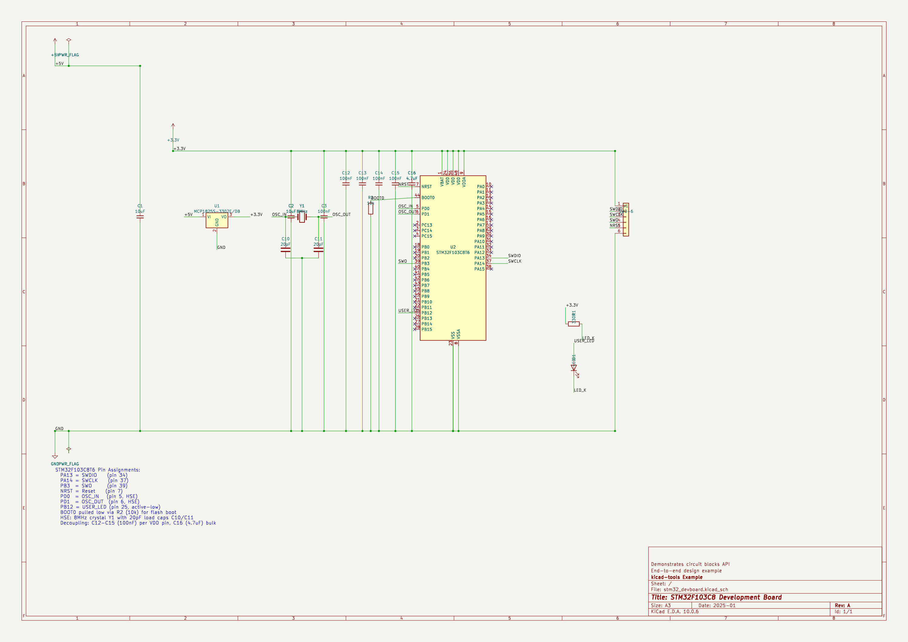
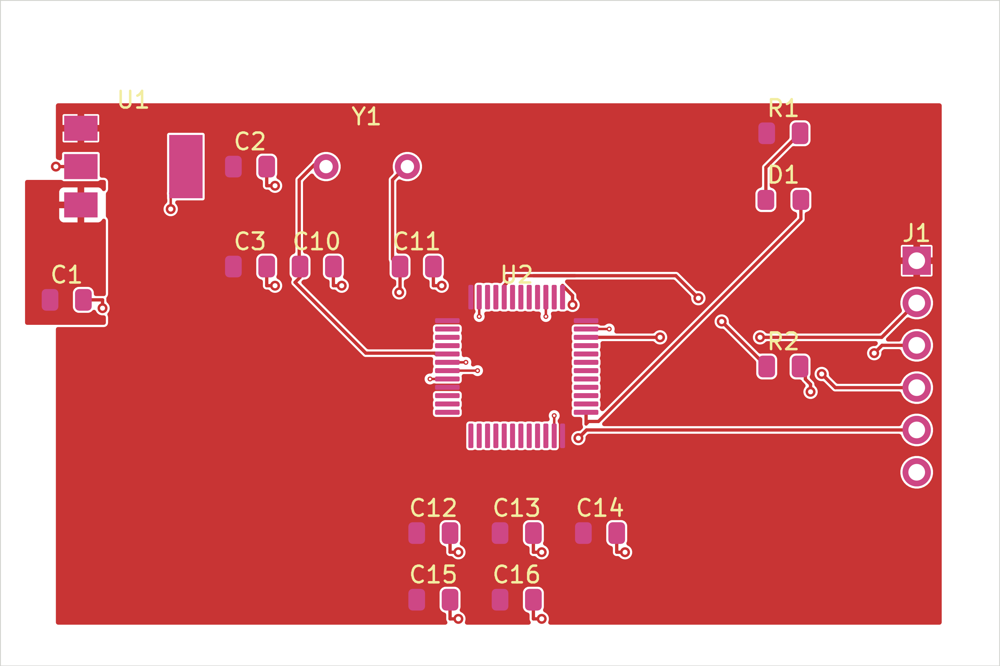
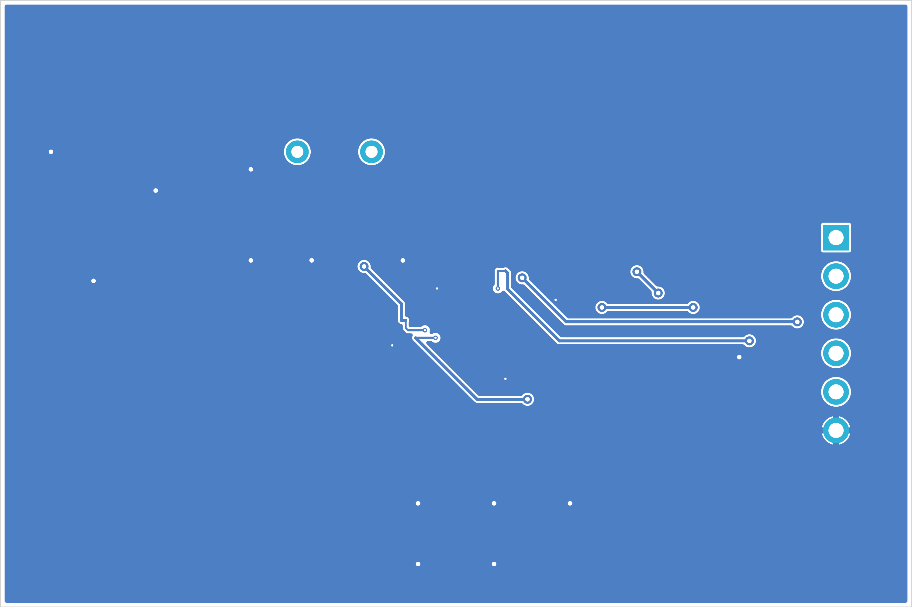
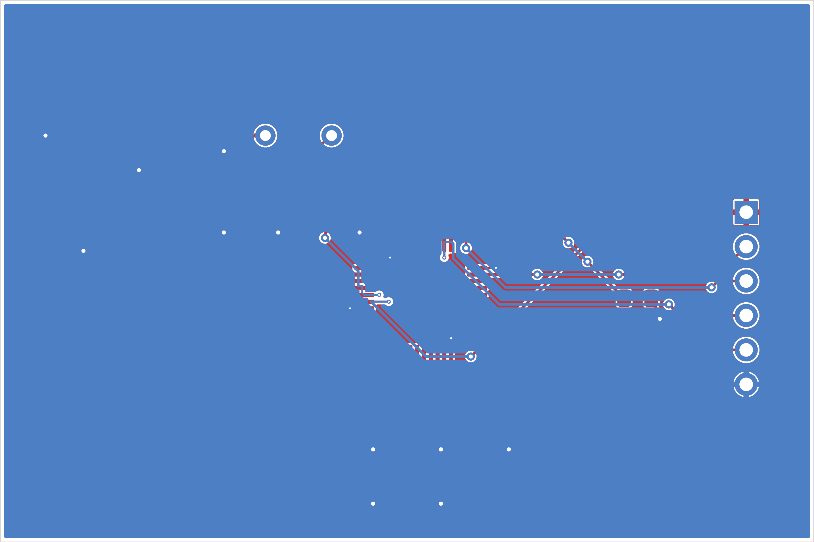
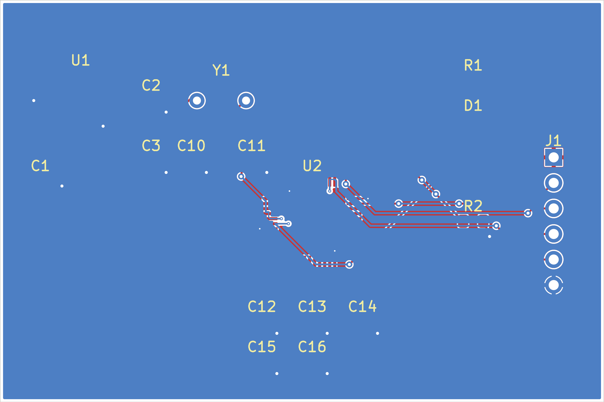
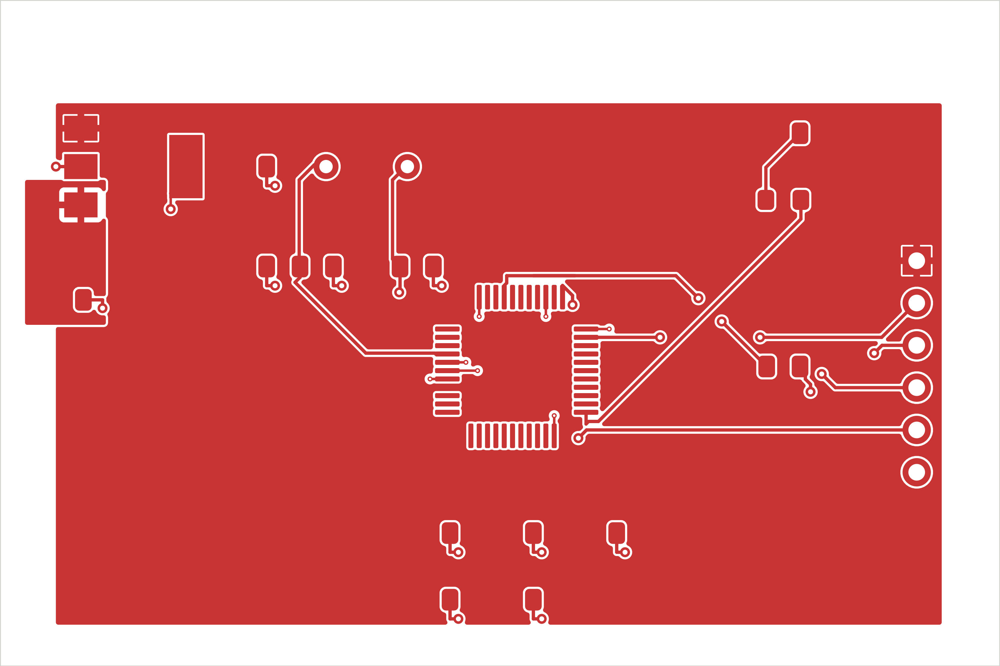
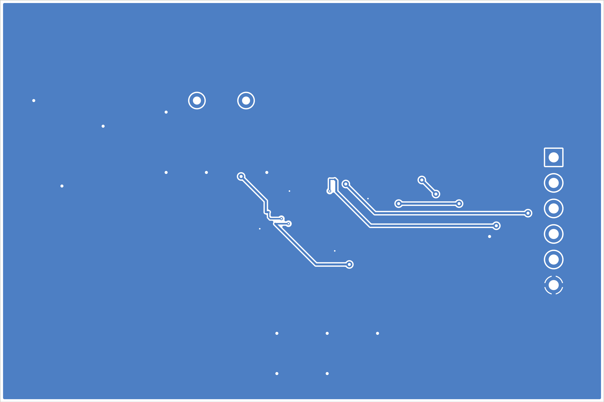

## Board Summary

| Property | Value |
|----------|-------|
| Layers | 2 copper (F.Cu, B.Cu) |
| Footprints | 17 (15 SMD, 2 THT, 0 other) |
| Nets | 12 |
| Traces | 158 segments |
| Vias | 29 |
| Board Size | 60.0 x 40.0 mm |

## Design Overview

### Theory of Operation

STM32F103C8 Development Board

End-to-end design example

Demonstrates circuit blocks API

### Power Architecture

**Power Rails**: +5V, +3.3V, GND

| Regulator | Device |
|-----------|--------|
| U1 | MCP1825S-3302E/DB |

## Assembly Notes

1 fine-pitch component; 1 polarized component

- **Fine-pitch components**: 1 (U2)
- **Polarized components**: 1 -- check orientation markings

## Hand-Solder (THT) Components

The following 2 through-hole components are **excluded from the SMT pick-and-place file** and must be hand-soldered (or wave/selective-soldered) after SMT assembly. They appear in the BOM for sourcing.

| Value | Package | Qty | References |
|-------|---------|-----|------------|
| SWD | PinHeader_1x06_P2.54mm_Vertical | 1 | J1 |
| 8MHz | Crystal_HC49-4H_Vertical | 1 | Y1 |

## ERC Status

Native KiCad ERC: **0 errors, 0 warnings**. The real MCP1825S pinout and
portable symbol library are checked; see native-erc.json.

## Schematic Overview

### Schematic: stm32_devboard

\newpage

## PCB Layout

### Copper

### Assembly

\newpage

## Copper Layers

### F.Cu

### B.Cu

\newpage

## Bill of Materials

| Value | Package | Qty | References | MPN | LCSC |
|-------|---------|-----|------------|-----|------|
| 100nF | C_0805_2012Metric | 5 | C3, C12, C13, C14, C15 |  |  |
| 10uF | C_0805_2012Metric | 2 | C1, C2 |  |  |
| 20pF | C_0805_2012Metric | 2 | C10, C11 |  |  |
| 4.7uF | C_0805_2012Metric | 1 | C16 |  |  |
| LED | LED_0805_2012Metric | 1 | D1 |  |  |
| SWD-6 | PinHeader_1x06_P2.54mm_Vertical | 1 | J1 |  |  |
| 10k | R_0805_2012Metric | 1 | R2 |  |  |
| 330R | R_0805_2012Metric | 1 | R1 |  |  |
| MCP1825S-3302E/DB | SOT-223-3_TabPin2 | 1 | U1 | MCP1825S-3302E/DB | C148031 |
| STM32F103C8T6 | LQFP-48_7x7mm_P0.5mm | 1 | U2 |  |  |
| 8MHz | Crystal_HC49-4H_Vertical | 1 | Y1 |  |  |

\newpage

## DRC Status

| Metric | Count |
|---|---|
| Errors | 0 |
| Warnings | 0 |

**PASS: 0 errors, 0 warnings** with the explicitly reviewed two-layer mechanical
drilling process. Ordinary through vias use a minimum 0.15mm drill, 0.30mm
diameter and 0.075mm annular ring. This paid JLC drilling option is documented
in manufacturing-requirements.json. No findings are suppressed. All eight
SMT-land drill overlaps were repaired with explicit connectivity tails.

Native DRC also has zero violations and opens. Schematic/copper LVS is clean.
See check-report.json for complete checks and override provenance,
native-drc.json for independent native evidence, and fill-consistency.json
for exact exported-copper parity against an independent native refill.

## Manufacturing Readiness

**READY for fabrication and assembly with the specified process.** Select the
paid 0.15mm mechanical-drill option, two layers, 1.6mm FR4, 1oz copper and
tented through vias. There are no laser microvias or drill overlaps with SMT
lands. U1 must be MCP1825S-3302E/DB (C148031); do not fit AMS1117.

Use the 15-placement SMT BOM/CPL, then manually solder J1 and Y1 from the
separate through-hole BOM. Power only from regulated 5V. First-article supply,
thermal/load, SWD, crystal, reset and LED tests remain unperformed; see
DESIGN_REVIEW.md. Geometric readiness does not claim physical qualification.

## Routing Status

| Metric | Value |
|--------|-------|
| Signal Net Completion | 100.0% (9/9) |
| Overall Completion | 91.7% |
| Complete Nets | 11 / 12 |
| Zone-Connected Nets | 3 |
| Incomplete Nets | 1 |
| Unconnected Pads | 1 |

### Zone-Connected Nets

- +3.3V
- +5V
- GND

### Incomplete Nets

- GND

## Cost Estimate

| Metric | Per Board (estimated) |
|--------|-------|
| PCB Fabrication | ~0.88 USD |
| Components (estimated) | ~1.36 USD |
| Assembly (estimated) | ~2.02 USD |
| **Total (estimated)** | **~4.26 USD** |
| Batch Quantity | 5 |
| Batch Total (estimated) | ~21.3 USD |

