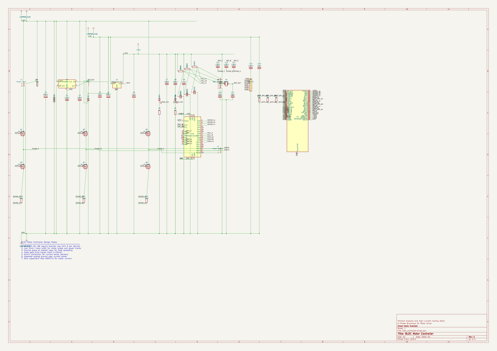
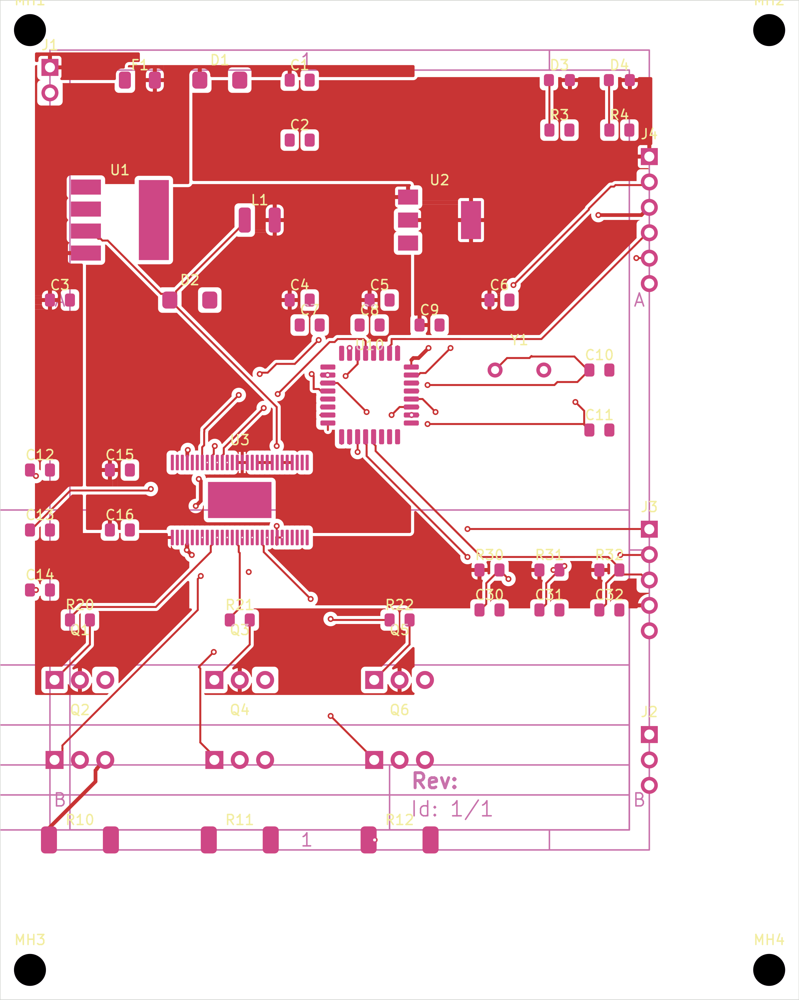
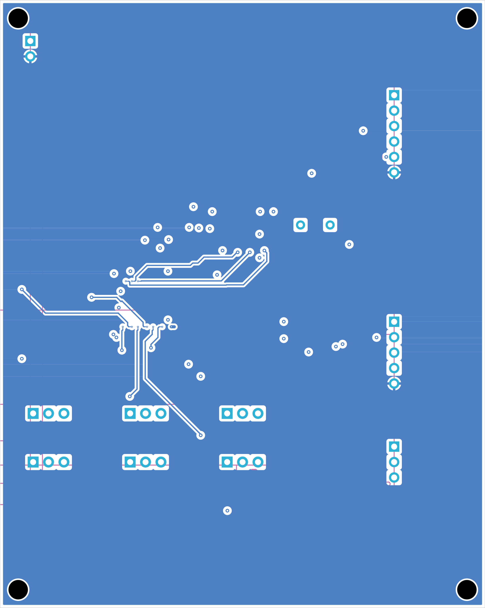
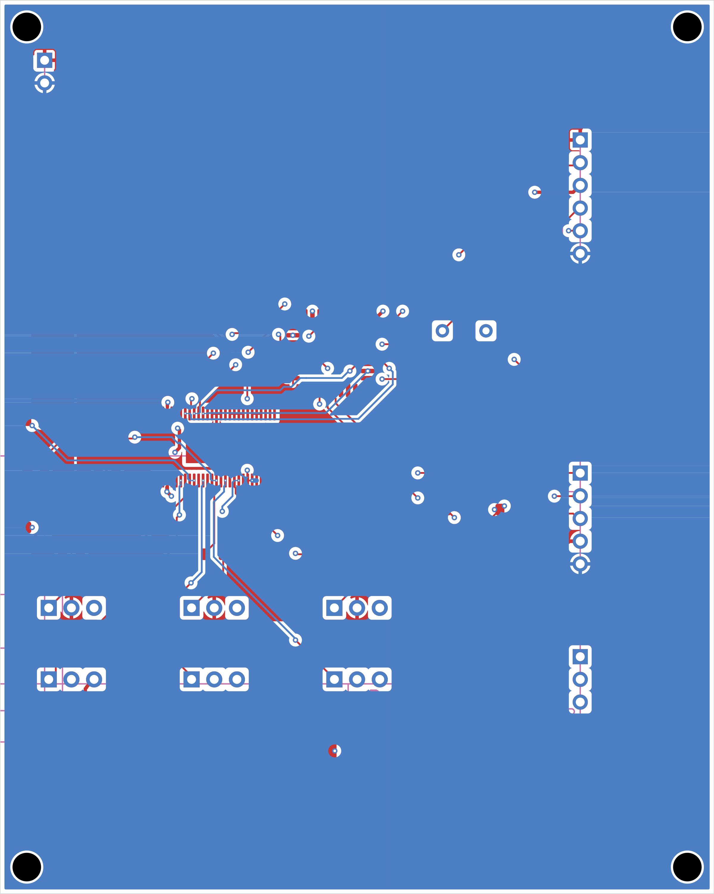
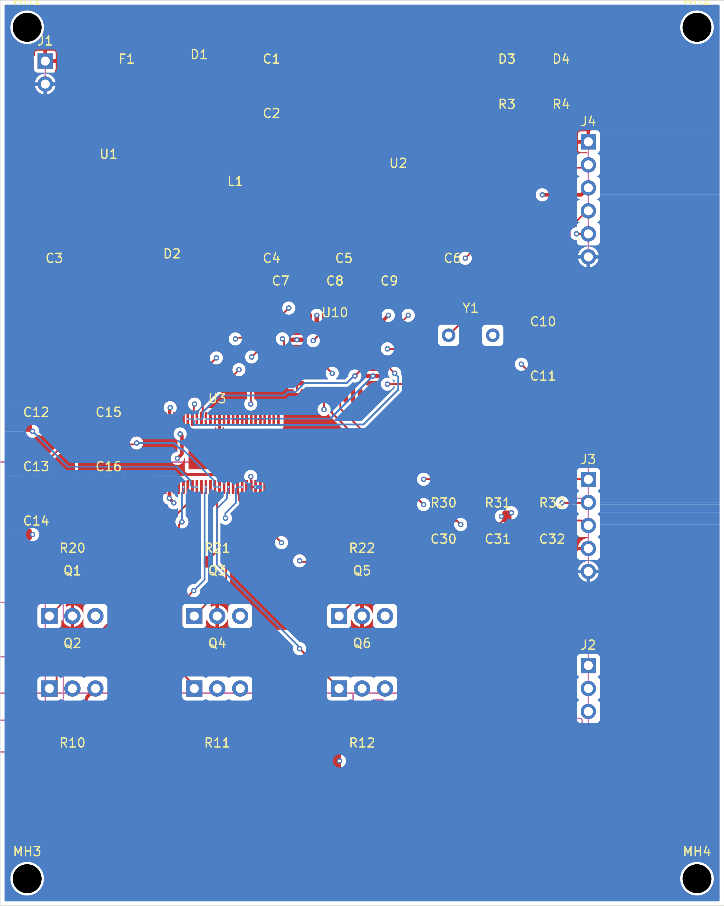
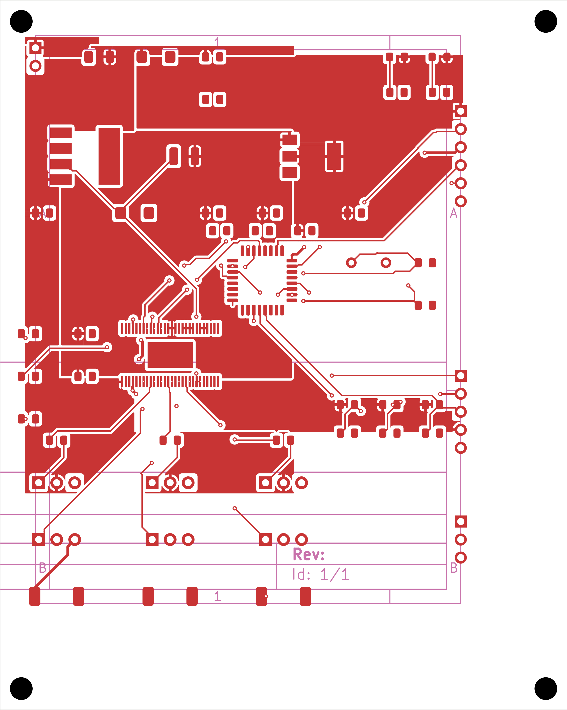
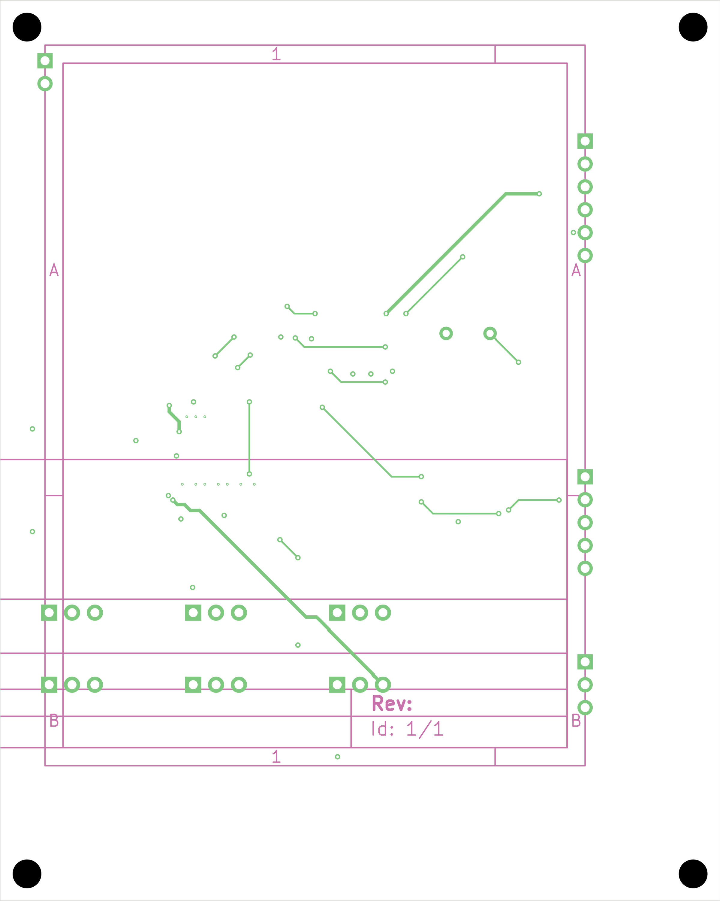
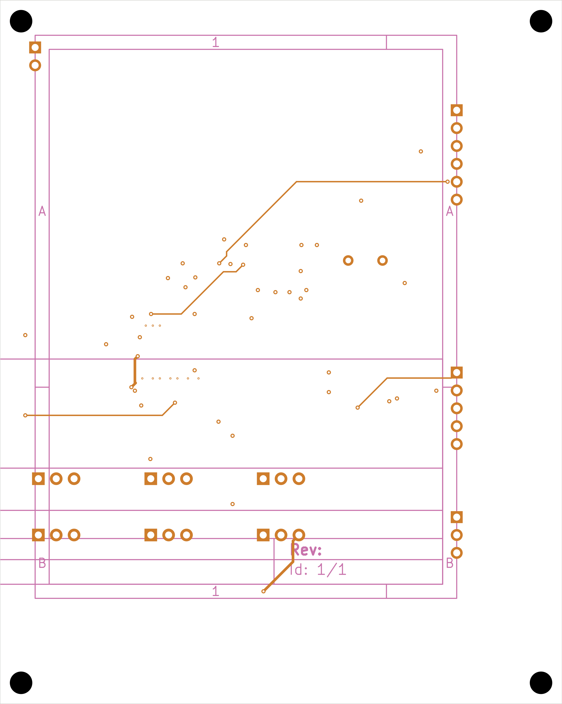
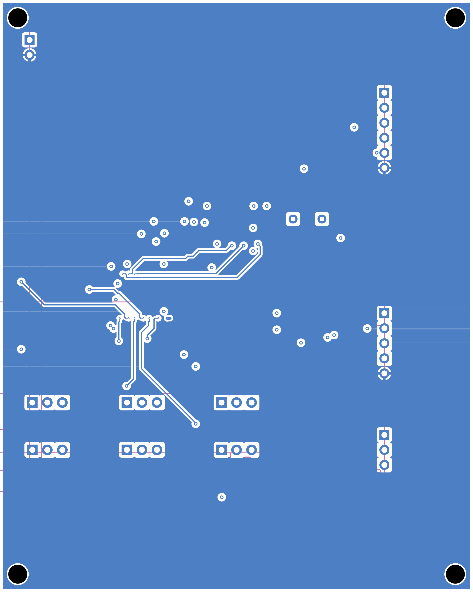

## Board Summary

| Property | Value |
|----------|-------|
| Layers | 4 copper (F.Cu, In1.Cu, In2.Cu, B.Cu) |
| Footprints | 55 (40 SMD, 11 THT, 4 other) |
| Nets | 52 |
| Traces | 881 segments |
| Vias | 56 |
| Board Size | 80.0 x 100.0 mm |

## Design Overview

### Theory of Operation

BLDC Motor Controller

3-Phase Brushless DC Motor Driver

Thermal analysis and high-current routing demo

### Power Architecture

**Power Rails**: +24V, +3V3, +5V, GND, PWR_FLAG

| Regulator | Device |
|-----------|--------|
| U1 | LM2596-5.0 |
| U2 | AMS1117-3.3 |

## Assembly Notes

1 fine-pitch component; 4 polarized components

- **Fine-pitch components**: 1 (U10)
- **Polarized components**: 4 -- check orientation markings

## ERC Status

| Metric | Count |
|--------|-------|
| Errors | 0 |
| Warnings | 0 |

**Status**: SKIPPED -- ERC skipped by user request

\newpage

## Schematic Overview

### Schematic: bldc_controller

\newpage

## PCB Layout

### Copper

### Assembly

\newpage

## Copper Layers

### F.Cu

### In1.Cu

### In2.Cu

### B.Cu

\newpage

## Bill of Materials

| Value | Package | Qty | References |
|-------|---------|-----|------------|
| 100nF | C_0805_2012Metric | 7 | C2, C7, C8, C12, C13, C14, C15 |
| 10nF |  | 3 | C30, C31, C32 |
| 10uF | C_0805_2012Metric | 3 | C5, C6, C16 |
| 20pF |  | 2 | C10, C11 |
| 220uF | C_0805_2012Metric | 2 | C3, C4 |
| 4.7uF | C_0805_2012Metric | 1 | C9 |
| 470uF | C_0805_2012Metric | 1 | C1 |
| PWR |  | 1 | D3 |
| SMBJ24A | D_SMA | 1 | D1 |
| SS34 | D_SMA | 1 | D2 |
| STATUS |  | 1 | D4 |
| 15A | Fuse_1206_3216Metric | 1 | F1 |
| Hall Sensors | PinHeader_1x05_P2.54mm_Vertical | 1 | J3 |
| Motor Output | PinHeader_1x03_P2.54mm_Vertical | 1 | J2 |
| Power Input | PinHeader_1x02_P2.54mm_Vertical | 1 | J1 |
| SWD-6 |  | 1 | J4 |
| 33uH | L_1210_3225Metric | 1 | L1 |
| IRLZ44N |  | 6 | Q1, Q2, Q3, Q4, Q5, Q6 |
| 10k |  | 3 | R30, R31, R32 |
| 1k |  | 2 | R3, R4 |
| 22 |  | 3 | R20, R21, R22 |
| 5mR |  | 3 | R10, R11, R12 |
| AMS1117-3.3 | SOT-223-3_TabPin2 | 1 | U2 |
| DRV8301 | HTSSOP-56-1EP_6.1x14mm_P0.5mm_EP3.61x6.35mm | 1 | U3 |
| LM2596-5.0 | TO-263-5_TabPin3 | 1 | U1 |
| STM32G431K8Tx | LQFP-32_7x7mm_P0.8mm | 1 | U10 |
| 8MHz |  | 1 | Y1 |

\newpage

## DRC Status

| Metric | Count |
|--------|-------|
| Errors | 36 |
| Warnings | 0 |
| Blocking | 36 |

**Status**: FAIL
### Violations by Type

| Violation Type | Count |
|----------------|-------|
| kicad-cli:starved_thermal | 12 |
| kicad-cli:annular_width | 10 |
| kicad-cli:via_diameter | 10 |
| connectivity | 9 |
| single_pad_net | 8 |
| kicad-cli:hole_clearance | 4 |

\newpage

## Manufacturing Readiness

**Verdict**: NOT_READY

### Action Items

- **[CRITICAL]** Fix 36 blocking DRC violations (kicad-cli: starved_thermal (12), annular_width (10), via_diameter (10))
- **[CRITICAL]** Increase min via drill: 0.150mm < 0.200mm required
- **[OPTIONAL]** Verify zone fill in KiCad: 7 nets appear incomplete but may be connected via zone fills
- **[OPTIONAL]** Verify zone fill in KiCad for 5 zone-connected nets
- **[OPTIONAL]** Analog net: ISENSE_A+ — analog signal; noise-sensitive, avoid crossing digital signals
- **[OPTIONAL]** Analog net: ISENSE_A- — analog signal; noise-sensitive, avoid crossing digital signals
- **[OPTIONAL]** Analog net: ISENSE_B+ — analog signal; noise-sensitive, avoid crossing digital signals
- **[OPTIONAL]** Analog net: ISENSE_B- — analog signal; noise-sensitive, avoid crossing digital signals
- **[OPTIONAL]** Analog net: ISENSE_C+ — analog signal; noise-sensitive, avoid crossing digital signals
- **[OPTIONAL]** Analog net: ISENSE_C- — analog signal; noise-sensitive, avoid crossing digital signals

\newpage

## Routing Status

| Metric | Value |
|--------|-------|
| Signal Net Completion | 82.1% (32/39) |
| Overall Completion | 82.7% |
| Complete Nets | 43 / 52 |
| Zone-Connected Nets | 5 |
| Single-Pad Nets | 8 (no routing needed) |
| Incomplete Nets | 9 |
| Unconnected Pads | 63 |

### Zone-Connected Nets

- +24V
- +3V3
- +5V
- GND
- VIN

### Single-Pad Nets

8 single-pad nets (no routing needed) -- not listed individually.

### Unrouted Signal Nets

- ISENSE_A-
- ISENSE_B+
- ISENSE_B-
- ISENSE_C-
- PHASE_A
- PHASE_B
- PHASE_C

### Unrouted Signal Nets

- ISENSE_A-
- ISENSE_B+
- ISENSE_B-
- ISENSE_C-
- PHASE_A
- PHASE_B
- PHASE_C

## Cost Estimate

| Metric | Per Board (estimated) |
|--------|-------|
| PCB Fabrication | ~3.6 USD |
| Components (estimated) | ~3.17 USD |
| Assembly (estimated) | ~2.35 USD |
| **Total (estimated)** | **~9.12 USD** |
| Batch Quantity | 5 |
| Batch Total (estimated) | ~45.61 USD |

