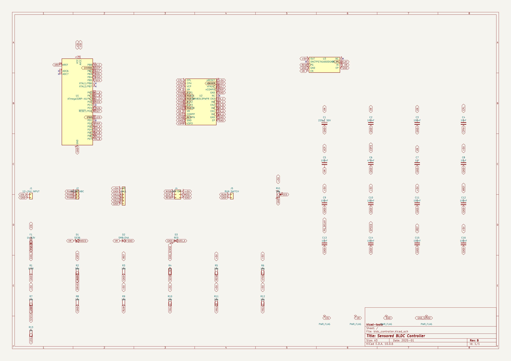
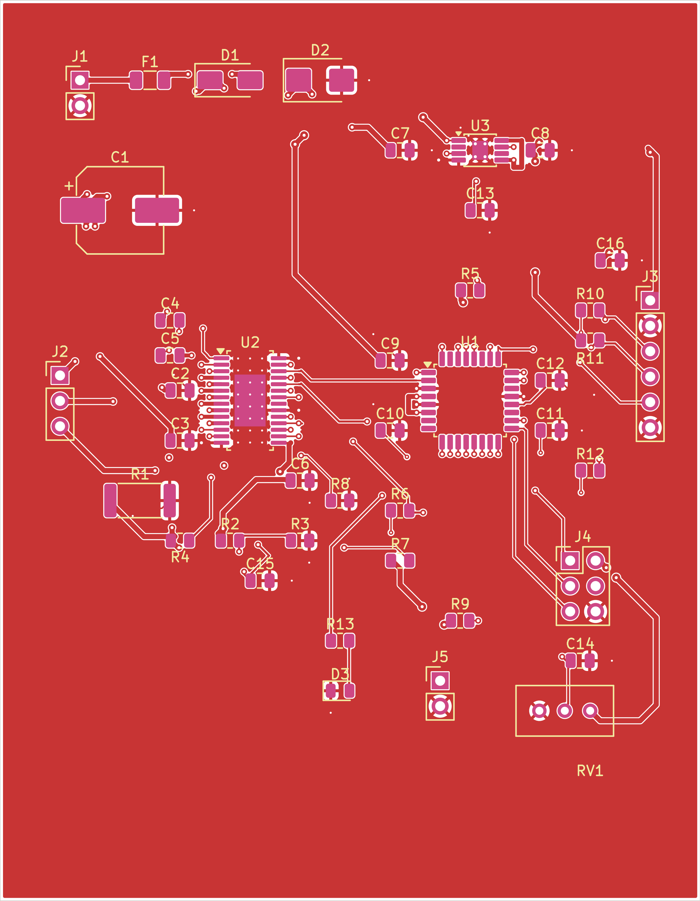
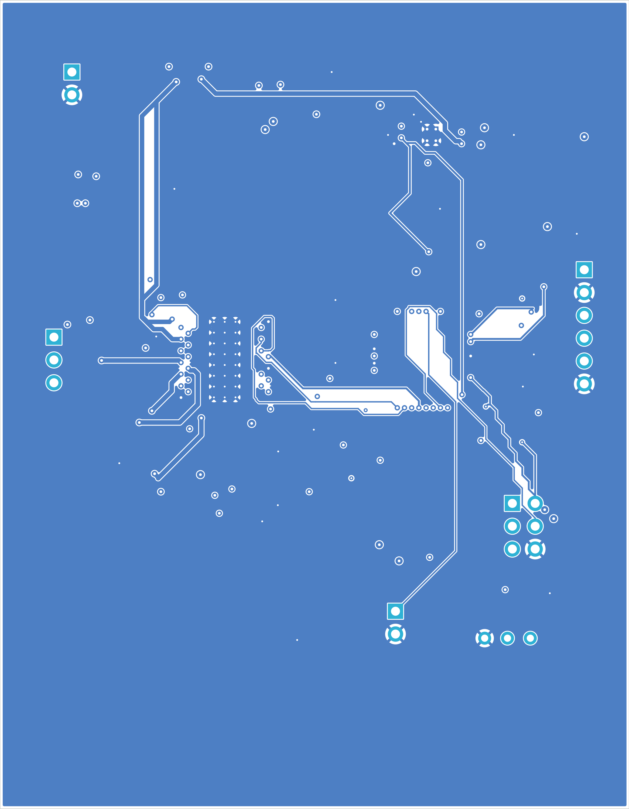
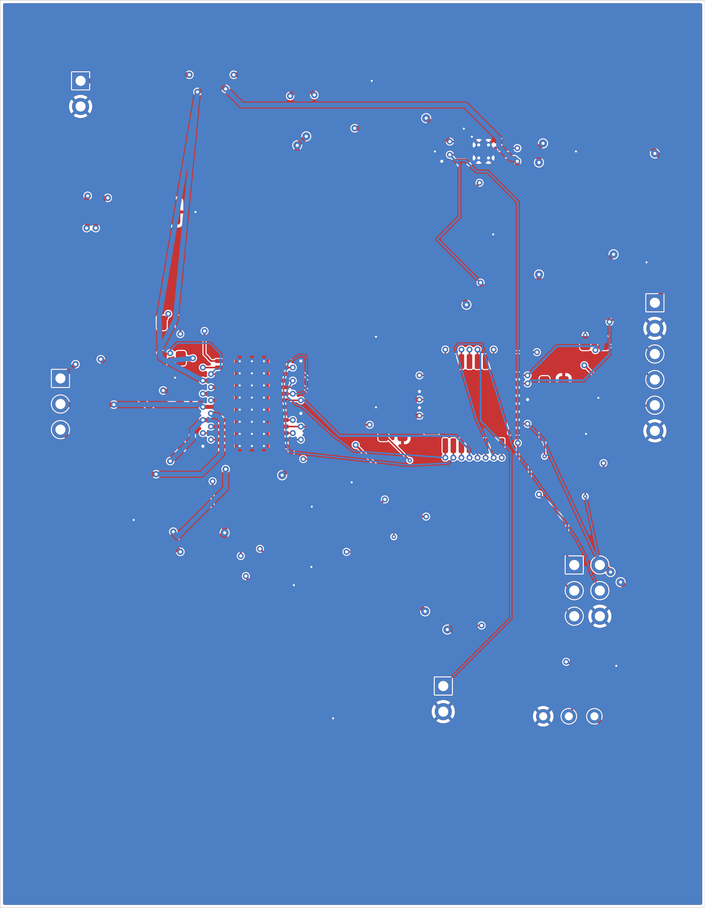
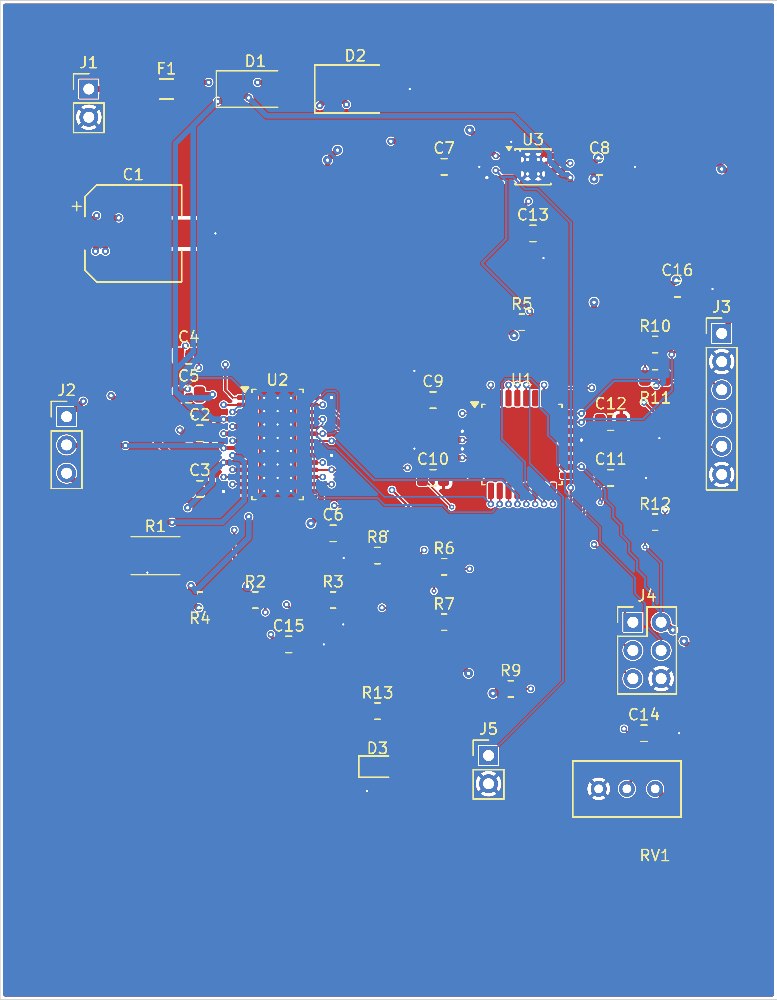
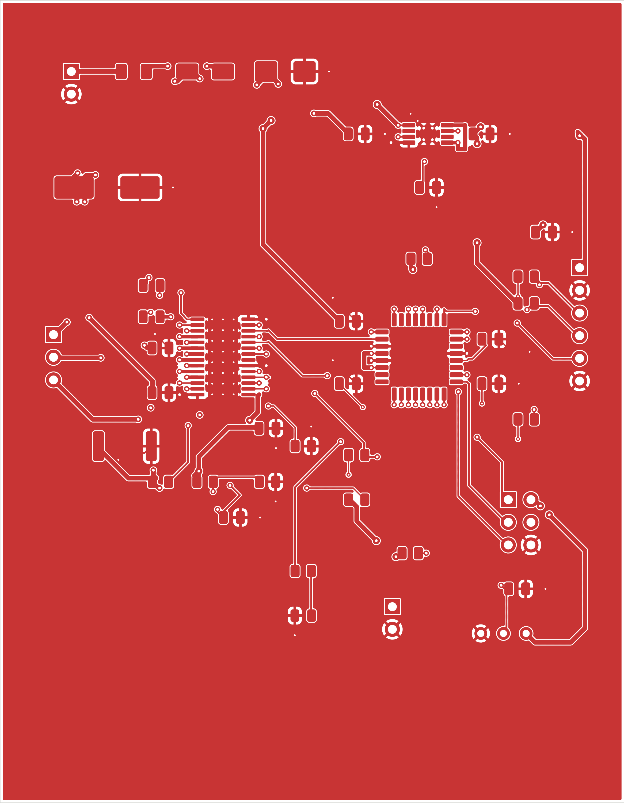
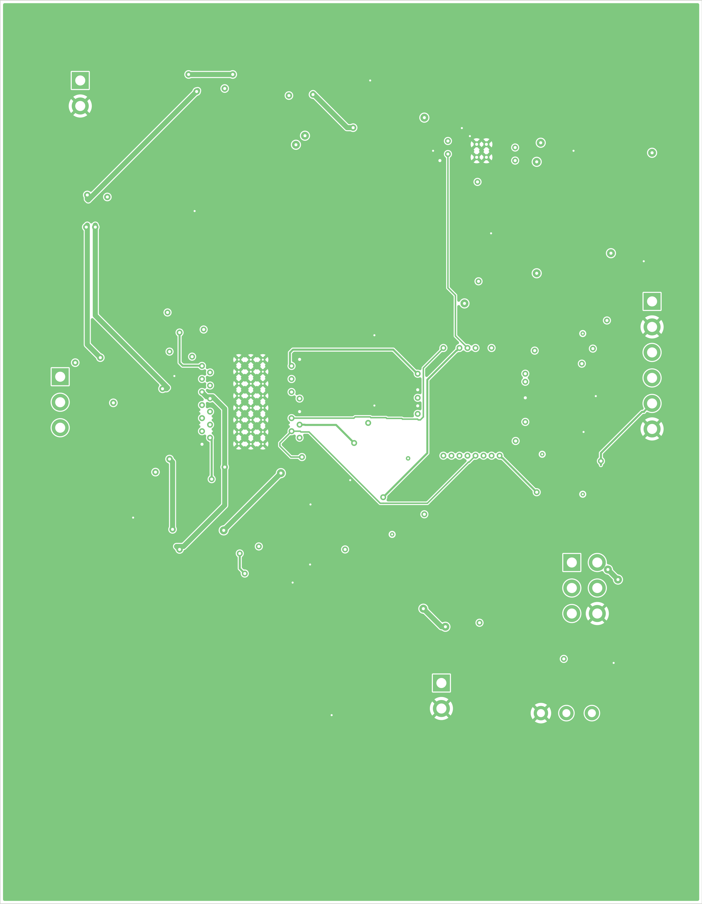
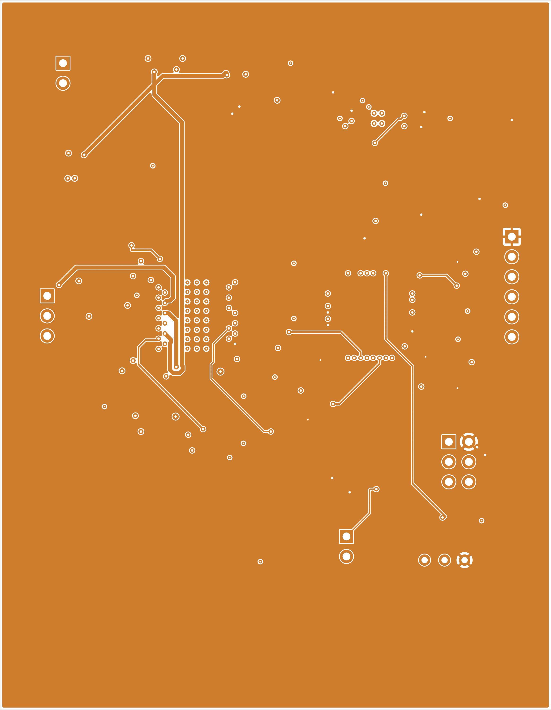
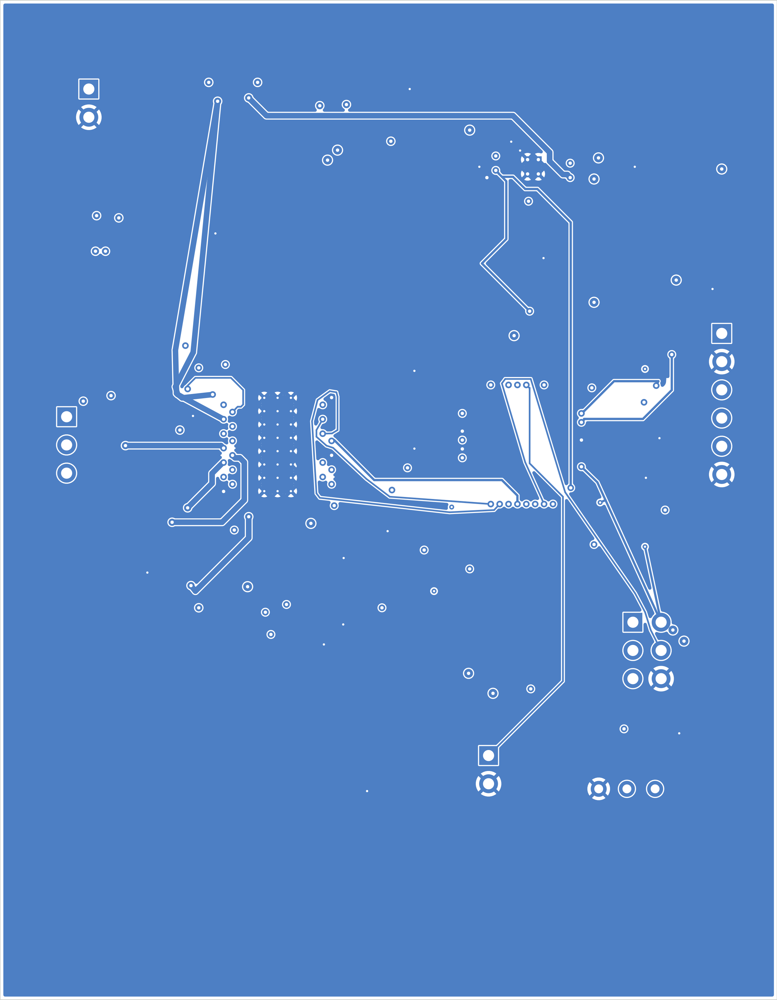

## Board Summary

| Property | Value |
|----------|-------|
| Layers | 4 copper (F.Cu, In1.Cu, In2.Cu, B.Cu) |
| Footprints | 42 (36 SMD, 6 THT, 0 other) |
| Nets | 37 |
| Traces | 7983 segments |
| Vias | 136 |
| Board Size | 70.0 x 90.0 mm |

## Stackup

| Layer | Type | Thickness (mm) | Material |
|-------|------|----------------|----------|
| F.Mask | Top Solder Mask | 0.01 | -- |
| F.Cu | copper | 0.035 | -- |
| dielectric 1 | prepreg | 0.2 | FR4 |
| In1.Cu | copper | 0.035 | -- |
| dielectric 2 | core | 1.0 | FR4 |
| In2.Cu | copper | 0.035 | -- |
| dielectric 3 | prepreg | 0.2 | FR4 |
| B.Cu | copper | 0.035 | -- |
| B.Mask | Bottom Solder Mask | 0.01 | -- |

## Design Overview

### Theory of Operation

Sensored BLDC Controller

### Communication Interfaces

| Protocol | Signals |
|----------|---------|
| SPI | MISO, MOSI, SCK |

### Power Architecture

**Power Rails**: PWR_FLAG

## Assembly Notes

1 fine-pitch component; 2 thermal pads; 4 polarized components

- **Fine-pitch components**: 1 (U1)
- **Thermal pads**: 2 -- verify solder paste apertures
- **Polarized components**: 4 -- check orientation markings

## Hand-Solder (THT) Components

The following 6 through-hole components are **excluded from the SMT pick-and-place file** and must be hand-soldered (or wave/selective-soldered) after SMT assembly. They appear in the BOM for sourcing.

| Value | Package | Qty | References |
|-------|---------|-----|------------|
| 12-24V INPUT | PinHeader_1x02_P2.54mm_Vertical | 1 | J1 |
| MOTOR ABC | PinHeader_1x03_P2.54mm_Vertical | 1 | J2 |
| HALL | PinHeader_1x06_P2.54mm_Vertical | 1 | J3 |
| AVR ISP | PinHeader_2x03_P2.54mm_Vertical | 1 | J4 |
| RUN SWITCH | PinHeader_1x02_P2.54mm_Vertical | 1 | J5 |
| 10k | Potentiometer_Bourns_3296W_Vertical | 1 | RV1 |

## ERC Status

| Metric | Count |
|--------|-------|
| Errors | 0 |
| Warnings | 0 |

**Status**: SKIPPED -- ERC skipped by user request

\newpage

## Schematic Overview

### Schematic: bldc_controller

\newpage

## PCB Layout

### Copper

### Assembly

\newpage

## Copper Layers

### F.Cu

### In1.Cu

### In2.Cu

### B.Cu

\newpage

## Bill of Materials

| Value | Package | Qty | References | MPN | LCSC |
|-------|---------|-----|------------|-----|------|
| 100nF | C_0805_2012Metric | 10 | C2, C3, C5, C9, C10, C11, C12, C14, C15, C16 | CC0805KRX7R9BB104 | C49678 |
| 10nF | C_0805_2012Metric | 2 | C4, C13 | CL21B103KBANNNC | C1710 |
| 10uF | C_0805_2012Metric | 1 | C8 | CL21A106KAYNNNE | C15850 |
| 1uF | C_0805_2012Metric | 1 | C7 | CL21B105KBFNNNE | C28323 |
| 220uF 50V | CP_Elec_8x10.5_PolarityMark | 1 | C1 | EEEFT1H221AP | C178594 |
| 470nF | C_0805_2012Metric | 1 | C6 | CL21B474KBFNNNE | C13967 |
| RED | LED_0805_2012Metric | 1 | D3 | 17-21SURC/S530-A2/TR8 | C131244 |
| SMBJ24A | D_SMB | 1 | D2 | SMBJ24A | C224017 |
| SS36 | D_SMA | 1 | D1 | SS36 | C16015 |
| 1A 63V | Fuse_1206_3216Metric | 1 | F1 | SF-1206S100-2 | C3167176 |
| 12-24V INPUT | PinHeader_1x02_P2.54mm_Vertical | 1 | J1 | ZX-PZ2.54-1-2PZZ | C7501260 |
| AVR ISP | PinHeader_2x03_P2.54mm_Vertical | 1 | J4 | 2.54-2*3P | C65114 |
| HALL | PinHeader_1x06_P2.54mm_Vertical | 1 | J3 | 2.54-1*6P | C37208 |
| MOTOR ABC | PinHeader_1x03_P2.54mm_Vertical | 1 | J2 | 2.54-1*3P | C49257 |
| RUN SWITCH | PinHeader_1x02_P2.54mm_Vertical | 1 | J5 | ZX-PZ2.54-1-2PZZ | C7501260 |
| 0.5R | R_2512_6332Metric | 1 | R1 | WSL2512R5000FEA | C511023 |
| 10k | Potentiometer_Bourns_3296W_Vertical | 1 | RV1 | 3296W-1-103LF | C34846 |
| 10k | R_0805_2012Metric | 9 | R3, R5, R6, R7, R8, R9, R10, R11, R12 | 0805W8F1002T5E | C17414 |
| 1k | R_0805_2012Metric | 2 | R4, R13 | 0805W8F1001T5E | C17513 |
| 56k | R_0805_2012Metric | 1 | R2 | 0805W8F5602T5E | C17756 |
| ATmega328P-AU | TQFP-32_7x7mm_P0.8mm | 1 | U1 | ATMEGA328P-AU | C14877 |
| DRV8313PWPR | TI_PWP0028C_EP3.4x9.7_Mask3.1x5.18_ThermalVias | 1 | U2 | DRV8313PWPR | C92482 |
| TPS7A1650DGNR | HVSSOP-8-1EP_3x3mm_P0.65mm_EP1.57x1.89mm_ThermalVias | 1 | U3 | TPS7A1650DGNR | C468238 |

\newpage

## DRC Status

| Metric | Count |
|--------|-------|
| Errors | 0 |
| Warnings | 0 |
| Blocking | 0 |

**Status**: PASS

\newpage

## Manufacturing Readiness

**Verdict**: WARNING

### Action Items

- **[OPTIONAL]** Verify zone fill in KiCad for 2 zone-connected nets
- **[OPTIONAL]** Analog net: GND_SENSE — analog signal; noise-sensitive, avoid crossing digital signals
- **[OPTIONAL]** Analog net: SENSE_IN — analog signal; noise-sensitive, avoid crossing digital signals

\newpage

## Routing Status

| Metric | Value |
|--------|-------|
| Signal Net Completion | 100.0% (35/35) |
| Overall Completion | 100.0% |
| Complete Nets | 37 / 37 |
| Zone-Connected Nets | 2 |
| Incomplete Nets | 0 |
| Unconnected Pads | 0 |

### Zone-Connected Nets

- +5V
- GND

## Cost Estimate

| Metric | Per Board (estimated) |
|--------|-------|
| PCB Fabrication | ~3.26 USD |
| Components (estimated) | ~2.23 USD |
| Assembly (estimated) | ~2.19 USD |
| **Total (estimated)** | **~7.67 USD** |
| Batch Quantity | 5 |
| Batch Total (estimated) | ~38.36 USD |

