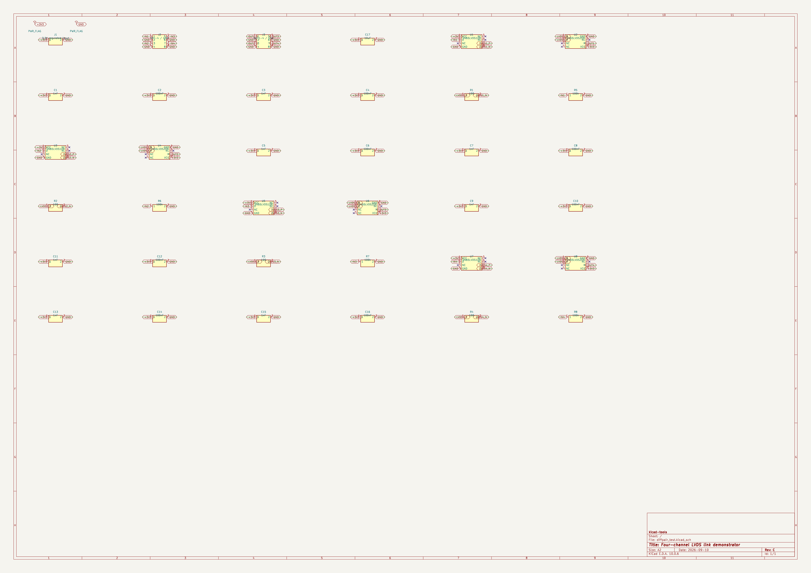
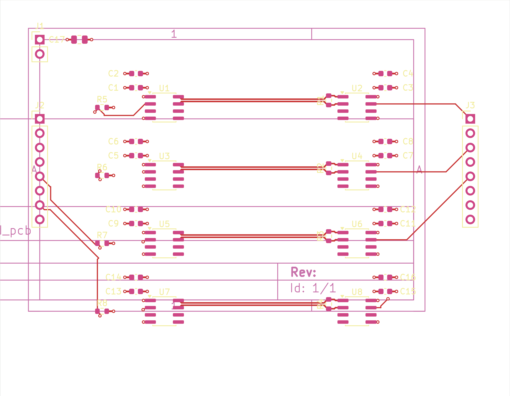
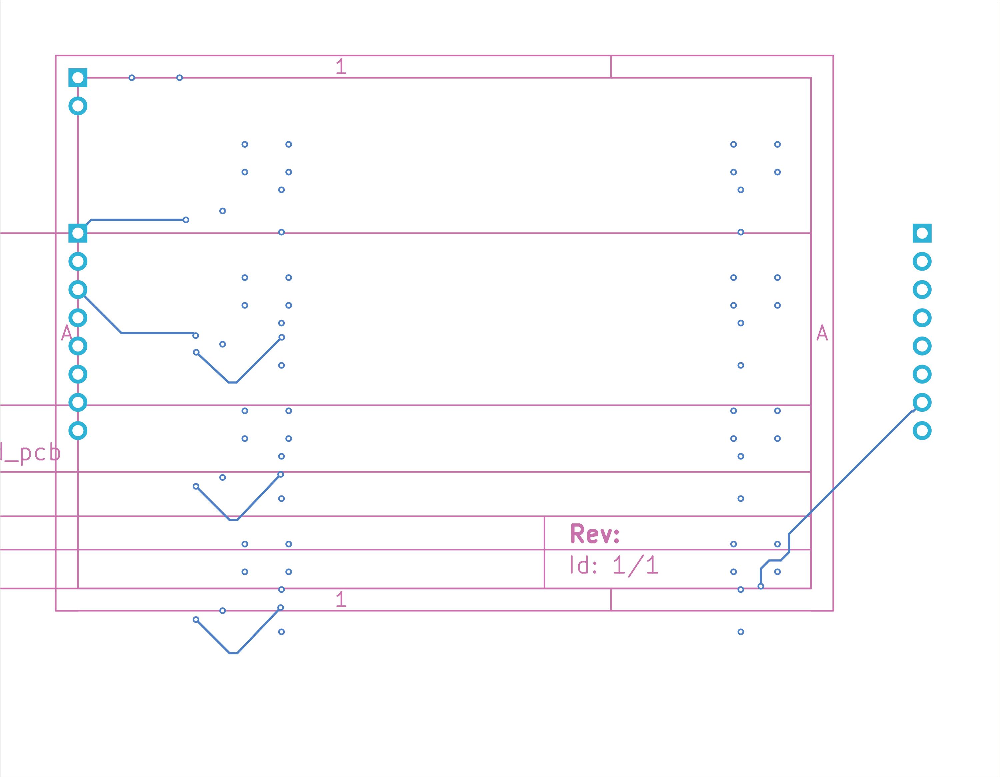
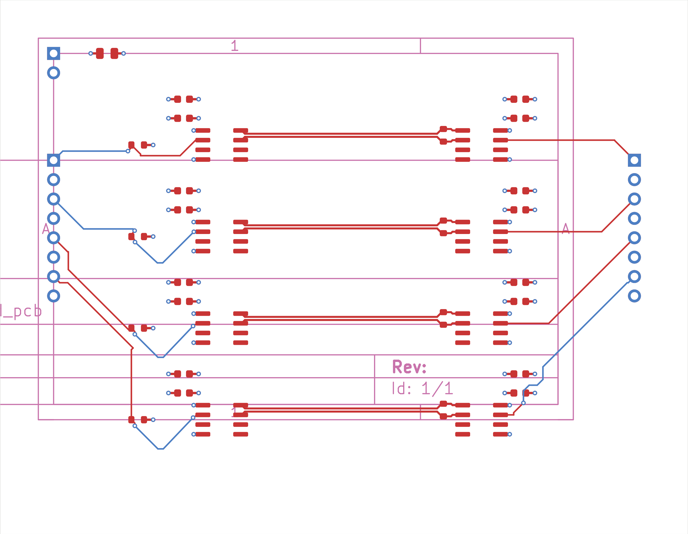
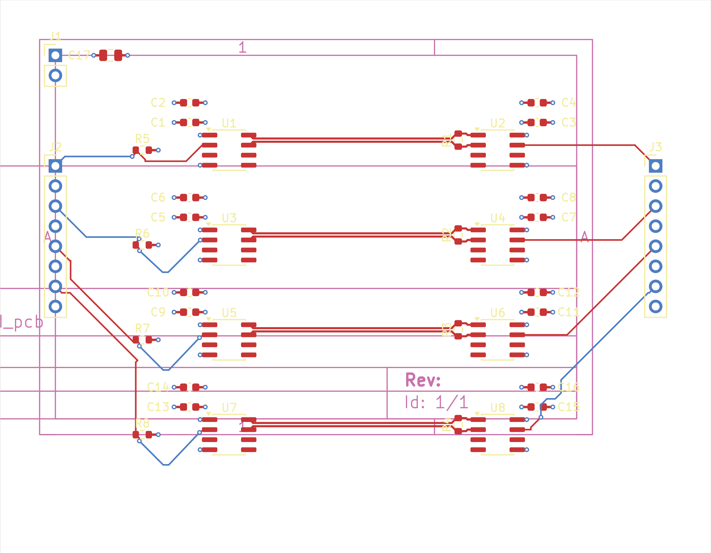
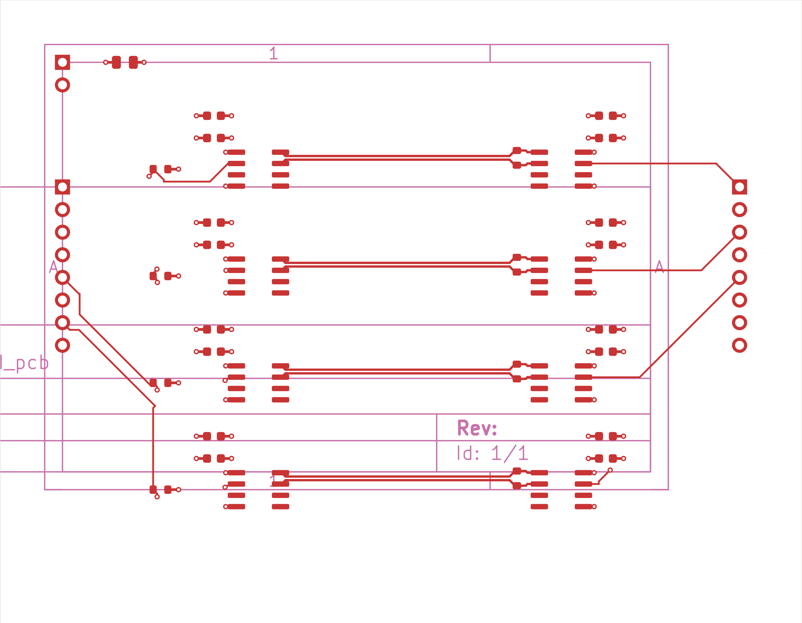
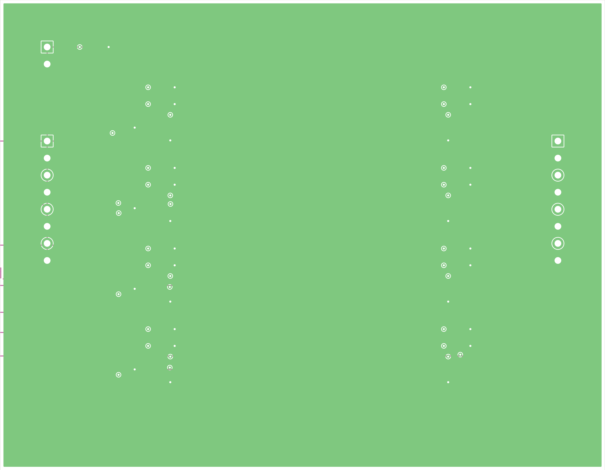
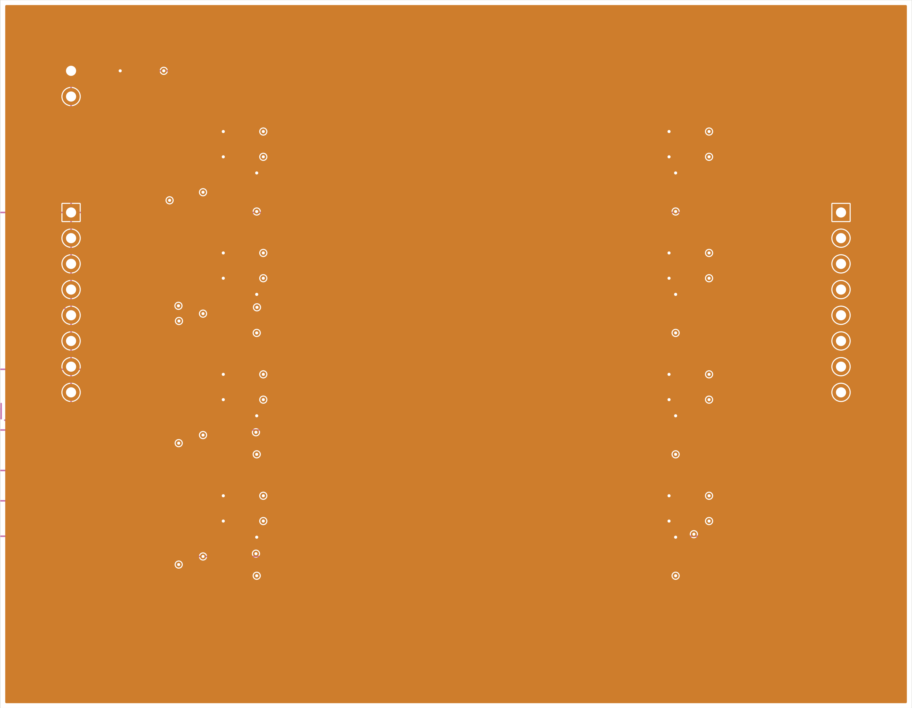
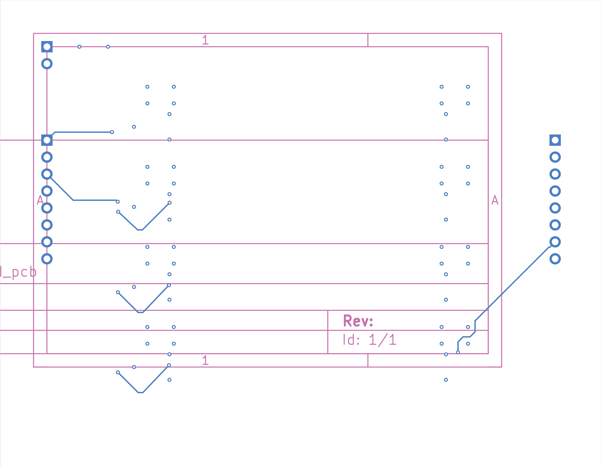

## Board Summary

| Property | Value |
|----------|-------|
| Layers | 4 copper (F.Cu, In1.Cu, In2.Cu, B.Cu) |
| Footprints | 36 (33 SMD, 3 THT, 0 other) |
| Nets | 18 |
| Traces | 188 segments |
| Vias | 63 |
| Board Size | 90.0 x 70.0 mm |

## Stackup

| Layer | Type | Thickness (mm) | Material |
|-------|------|----------------|----------|
| F.Cu | copper | 0.035 | -- |
| dielectric 1 | prepreg | 0.2104 | 7628 |
| In1.Cu | copper | 0.0152 | -- |
| dielectric 2 | core | 1.065 | FR4 |
| In2.Cu | copper | 0.0152 | -- |
| dielectric 3 | prepreg | 0.2104 | 7628 |
| B.Cu | copper | 0.035 | -- |

## Design Overview

### Theory of Operation

Four-channel LVDS link demonstrator

### Power Architecture

**Power Rails**: PWR_FLAG

## Hand-Solder (THT) Components

The following 3 through-hole components are **excluded from the SMT pick-and-place file** and must be hand-soldered (or wave/selective-soldered) after SMT assembly. They appear in the BOM for sourcing.

| Value | Package | Qty | References |
|-------|---------|-----|------------|
| 3.3V regulated input | PinHeader_1x02_P2.54mm_Vertical | 1 | J1 |
| IN1-4 / GND | PinHeader_1x08_P2.54mm_Vertical | 1 | J2 |
| OUT1-4 / GND | PinHeader_1x08_P2.54mm_Vertical | 1 | J3 |

## ERC Status

| Metric | Count |
|--------|-------|
| Errors | 0 |
| Warnings | 0 |

**Status**: PASSED -- independent native ERC: zero errors and warnings.

\newpage

## Schematic Overview

### Schematic: diffpair_test

\newpage

## PCB Layout

### Copper

### Assembly

\newpage

## Copper Layers

### F.Cu

### In1.Cu

### In2.Cu

### B.Cu

\newpage

## Bill of Materials

| Value | Package | Qty | References |
|-------|---------|-----|------------|
| 100nF | C_0603_1608Metric | 8 | C2, C4, C6, C8, C10, C12, C14, C16 |
| 10uF | C_0805_2012Metric | 1 | C17 |
| 1nF | C_0603_1608Metric | 8 | C1, C3, C5, C7, C9, C11, C13, C15 |
| 3.3V regulated input | PinHeader_1x02_P2.54mm_Vertical | 1 | J1 |
| IN1-4 / GND | PinHeader_1x08_P2.54mm_Vertical | 1 | J2 |
| OUT1-4 / GND | PinHeader_1x08_P2.54mm_Vertical | 1 | J3 |
| 100 | R_0603_1608Metric | 4 | R1, R2, R3, R4 |
| 100k | R_0603_1608Metric | 4 | R5, R6, R7, R8 |
| SN65LVDS1DR | SOIC-8_3.9x4.9mm_P1.27mm | 4 | U1, U3, U5, U7 |
| SN65LVDS2DR | SOIC-8_3.9x4.9mm_P1.27mm | 4 | U2, U4, U6, U8 |

\newpage

## DRC Status

| Metric | Count |
|--------|-------|
| Errors | 0 |
| Warnings | 0 |
| Blocking | 0 |

**Status**: PASS

\newpage

## Manufacturing Readiness

**Verdict**: READY

### Action Items

- **[OPTIONAL]** Verify zone fill in KiCad for 2 zone-connected nets

\newpage

## Routing Status

| Metric | Value |
|--------|-------|
| Signal Net Completion | 100.0% (16/16) |
| Overall Completion | 100.0% |
| Complete Nets | 18 / 18 |
| Zone-Connected Nets | 2 |
| Incomplete Nets | 0 |
| Unconnected Pads | 0 |

### Zone-Connected Nets

- +3V3
- GND

## Cost Estimate

| Metric | Per Board (estimated) |
|--------|-------|
| PCB Fabrication | ~3.26 USD |
| Components (estimated) | ~4.4 USD |
| Assembly (estimated) | ~2.14 USD |
| **Total (estimated)** | **~9.81 USD** |
| Batch Quantity | 5 |
| Batch Total (estimated) | ~49.03 USD |

