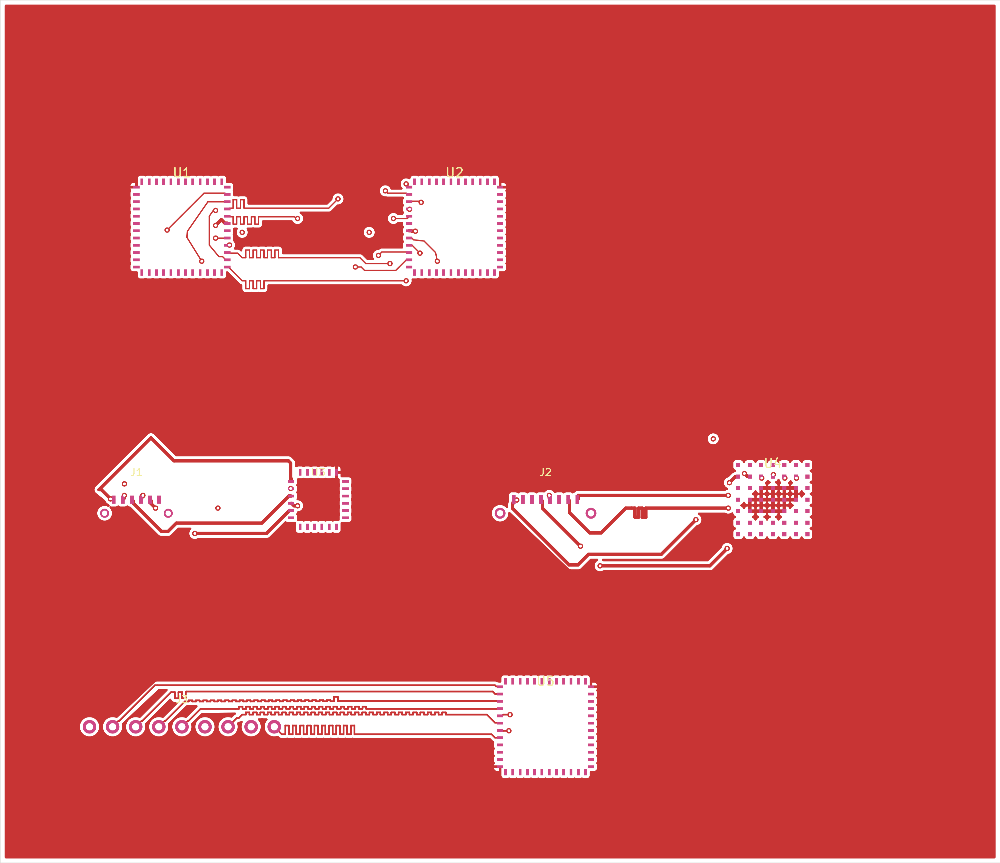
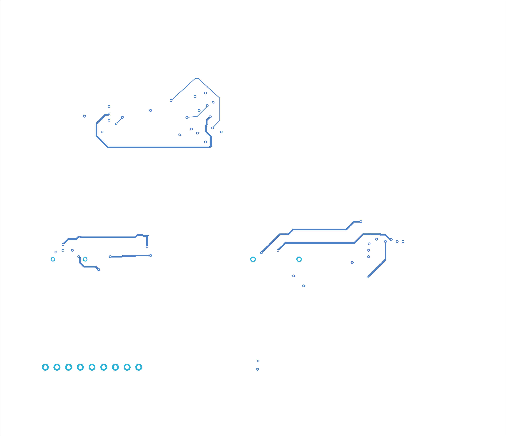
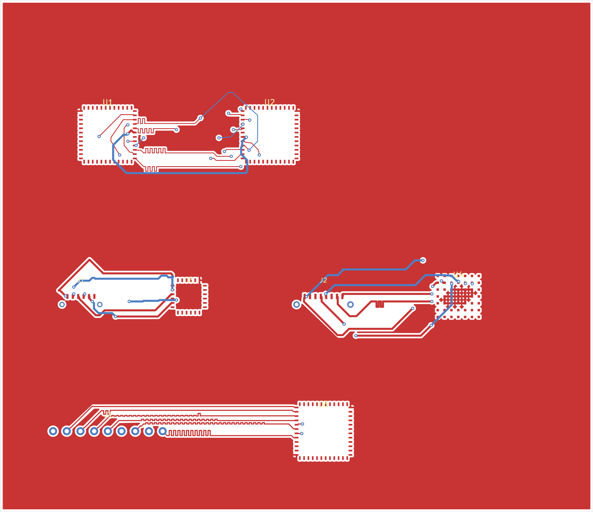
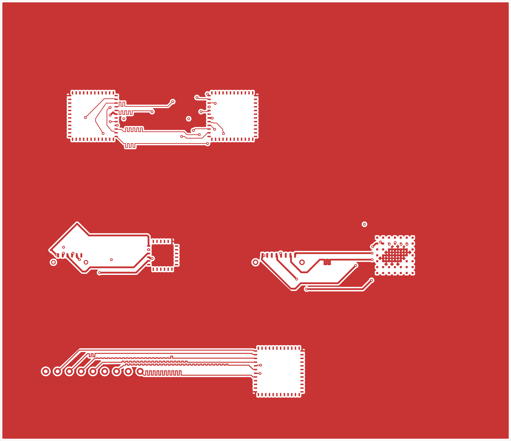
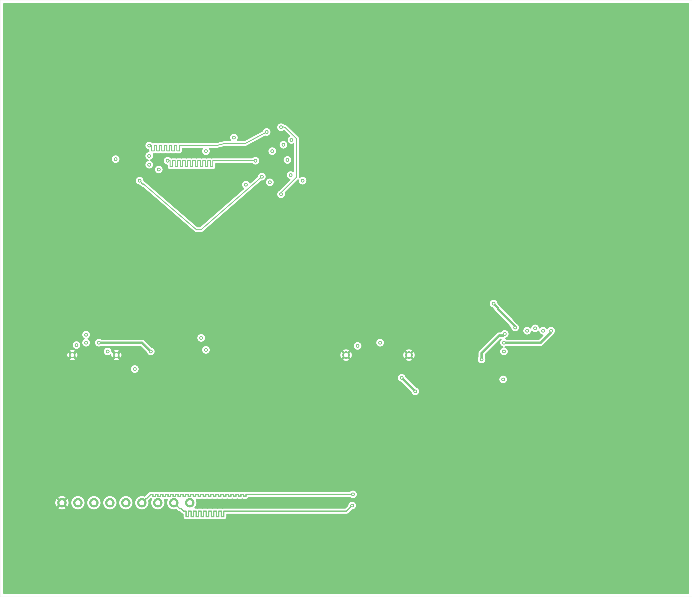
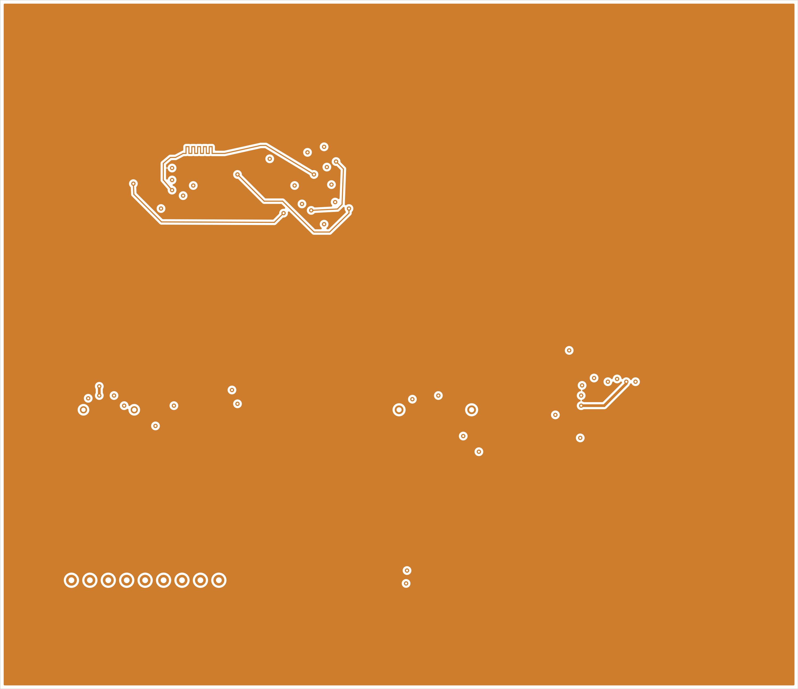
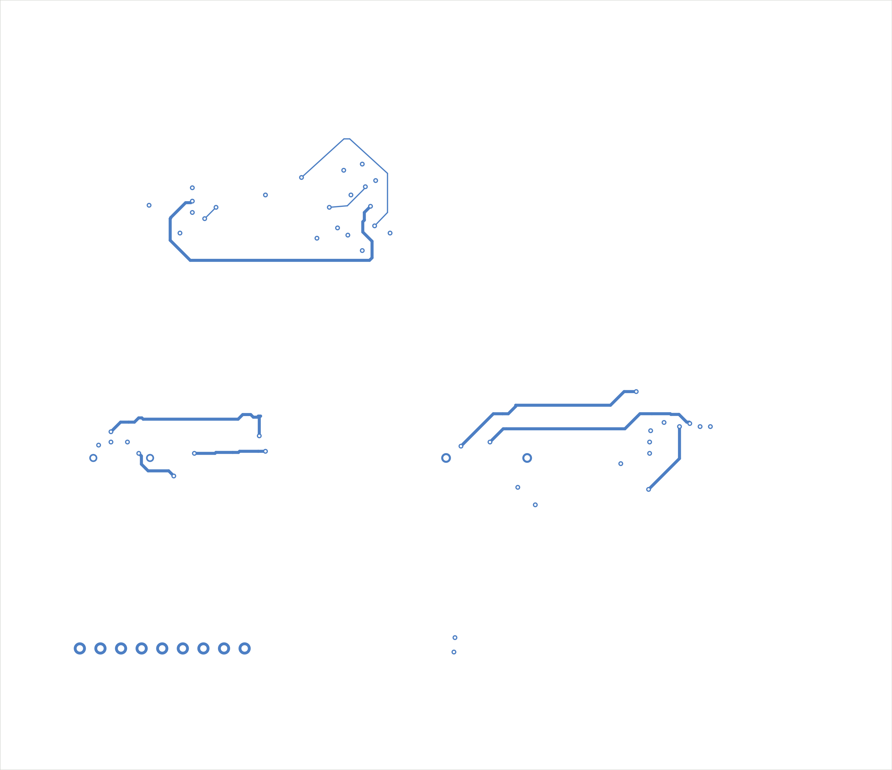

## Board Summary

| Property | Value |
|----------|-------|
| Layers | 4 copper (F.Cu, In1.Cu, In2.Cu, B.Cu) |
| Footprints | 8 (5 SMD, 3 THT, 0 other) |
| Nets | 34 |
| Traces | 1150 segments |
| Vias | 48 |
| Board Size | 110.0 x 95.0 mm |

## Design Overview

### Theory of Operation

Match-Group Test Board

N-trace + group-of-pairs match-group regression testbench

Epic #2661 Phase 3L (issue #2724)

### Power Architecture

**Power Rails**: PWR_FLAG

## Assembly Notes

5 fine-pitch components

- **Fine-pitch components**: 5 (U2, U1, U5, U4, U3)

## ERC Status

| Metric | Count |
|--------|-------|
| Errors | 0 |
| Warnings | 0 |

**Status**: SKIPPED -- ERC skipped by user request

\newpage

## PCB Layout

### Copper

### Assembly

\newpage

## Copper Layers

### F.Cu

### In1.Cu

### In2.Cu

### B.Cu

\newpage

## Bill of Materials

| Value | Package | Qty | References |
|-------|---------|-----|------------|
| ADDR_HDR | PinHeader_1x09_P2.54mm_Vertical | 1 | J3 |
| FFC6_MIPI | FFC_6P_1.0mm | 1 | J1 |
| HDMI19 | HDMI_A_Receptacle | 1 | J2 |
| BGA49_HDMI | BGA-49_5.0x5.0mm_Layout7x7_P0.5mm | 1 | U4 |
| QFN24_MIPI | QFN-24-1EP_4x4mm_P0.5mm | 1 | U3 |
| QFN48_DDR_CTRL | QFN-48-1EP_7x7mm_P0.5mm | 1 | U1 |
| QFN48_DRAM | QFN-48-1EP_7x7mm_P0.5mm | 1 | U2 |
| QFP48_SRAM | LQFP-48_7x7mm_P0.5mm | 1 | U5 |

\newpage

## DRC Status

| Metric | Count |
|--------|-------|
| Errors | 4 |
| Warnings | 8 |
| Blocking | 4 |

**Status**: FAIL
### Violations by Type

| Violation Type | Count |
|----------------|-------|
| connectivity | 5 |
| silkscreen_text_height | 4 |
| zone_unfilled | 3 |
| clearance_segment_via | 1 |
| clearance_pad_segment | 1 |
| clearance_pad_via | 1 |
| diffpair_clearance_intra | 1 |
| silkscreen_over_pad | 1 |

\newpage

## Manufacturing Readiness

**Verdict**: NOT_READY

### Action Items

- **[CRITICAL]** Fix 4 blocking DRC violations (clearance_segment_via (1), clearance_pad_segment (1), clearance_pad_via (1))
- **[OPTIONAL]** Verify zone fill in KiCad: 3 nets appear incomplete but may be connected via zone fills
- **[OPTIONAL]** Verify zone fill in KiCad for 3 zone-connected nets
- **[OPTIONAL]** Review 8 DRC warnings

\newpage

## Routing Status

| Metric | Value |
|--------|-------|
| Signal Net Completion | 90.3% (28/31) |
| Overall Completion | 85.3% |
| Complete Nets | 29 / 34 |
| Zone-Connected Nets | 3 |
| Incomplete Nets | 5 |
| Unconnected Pads | 161 |

### Zone-Connected Nets

- +1V2
- +1V8
- GND

### Unrouted Signal Nets

- DQS_P
- MIPI_DAT1_N
- TMDS_D0_N

### Unrouted Signal Nets

- DQS_P
- MIPI_DAT1_N
- TMDS_D0_N

## Cost Estimate

| Metric | Per Board (estimated) |
|--------|-------|
| PCB Fabrication | ~4.09 USD |
| Components (estimated) | ~2.8 USD |
| Assembly (estimated) | ~2.05 USD |
| **Total (estimated)** | **~8.94 USD** |
| Batch Quantity | 5 |
| Batch Total (estimated) | ~44.72 USD |

