## Board Summary

| Property | Value |
|----------|-------|
| Layers | 6 copper (F.Cu, In1.Cu, In2.Cu, In3.Cu, In4.Cu, B.Cu) |
| Footprints | 43 (40 SMD, 3 THT, 0 other) |
| Nets | 55 |
| Traces | 8394 segments |
| Vias | 192 |
| Board Size | 100.0 x 80.0 mm |

## Stackup

| Layer | Type | Thickness (mm) | Material |
|-------|------|----------------|----------|
| F.Mask | Top Solder Mask | 0.01 | -- |
| F.Cu | copper | 0.035 | -- |
| dielectric 1 | prepreg | 0.1164 | FR4 2116 |
| In1.Cu | copper | 0.0152 | -- |
| dielectric 2 | core | 0.13 | FR4 |
| In2.Cu | copper | 0.0152 | -- |
| dielectric 3 | prepreg | 0.1164 | FR4 2116 |
| dielectric 3 (sublayer 2) | prepreg | 0.7 | FR4 core |
| dielectric 3 (sublayer 3) | prepreg | 0.1164 | FR4 2116 |
| In3.Cu | copper | 0.0152 | -- |
| dielectric 4 | core | 0.13 | FR4 |
| In4.Cu | copper | 0.0152 | -- |
| dielectric 5 | prepreg | 0.1164 | FR4 2116 |
| B.Cu | copper | 0.035 | -- |
| B.Mask | Bottom Solder Mask | 0.01 | -- |

## Design Overview

### Theory of Operation

Board 07 real SDRAM memory test — DRAFT

### Communication Interfaces

| Protocol | Signals |
|----------|---------|
| UART | UART_RX, UART_TX |

### Power Architecture

**Power Rails**: PWR_FLAG

| Regulator | Device |
|-----------|--------|
| U3 | AP2112K-3.3TRG1 |

## Assembly Notes

1 fine-pitch component; 2 polarized components

- **Fine-pitch components**: 1 (U1)
- **Polarized components**: 2 -- check orientation markings

## Hand-Solder (THT) Components

The following 3 through-hole components are **excluded from the SMT pick-and-place file** and must be hand-soldered (or wave/selective-soldered) after SMT assembly. They appear in the BOM for sourcing.

| Value | Package | Qty | References |
|-------|---------|-----|------------|
| 5V_INPUT | PinHeader_1x02_P2.54mm_Vertical | 1 | J1 |
| SWD_3V3 | PinHeader_1x06_P2.54mm_Vertical | 1 | J2 |
| UART_3V3 | PinHeader_1x03_P2.54mm_Vertical | 1 | J3 |

## ERC Status

| Metric | Count |
|--------|-------|
| Errors | 0 |
| Warnings | 0 |

**Status**: SKIPPED -- ERC skipped by user request

\newpage

## Schematic Overview

### Schematic: matchgroup_test

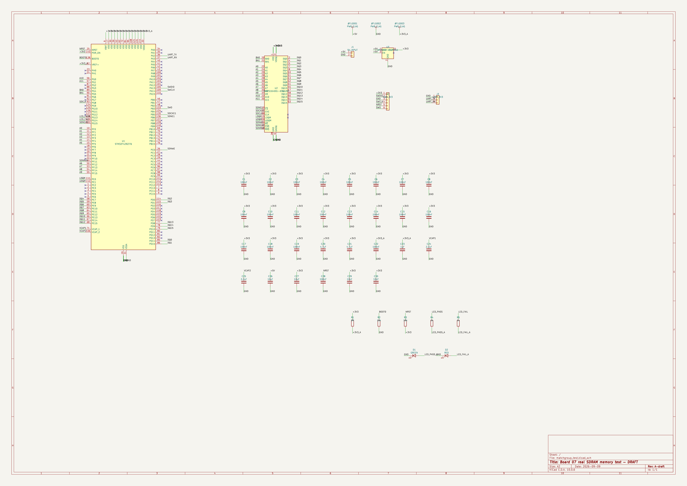

\newpage

## PCB Layout

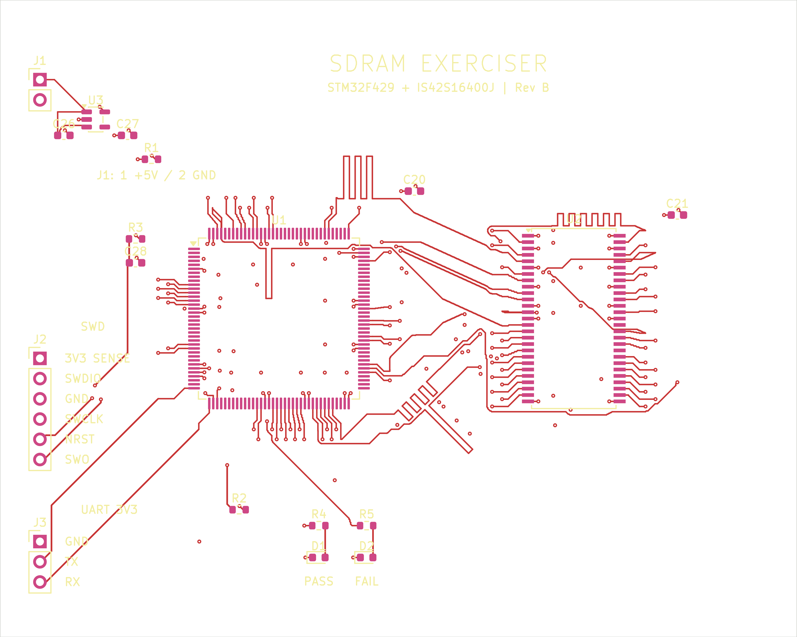

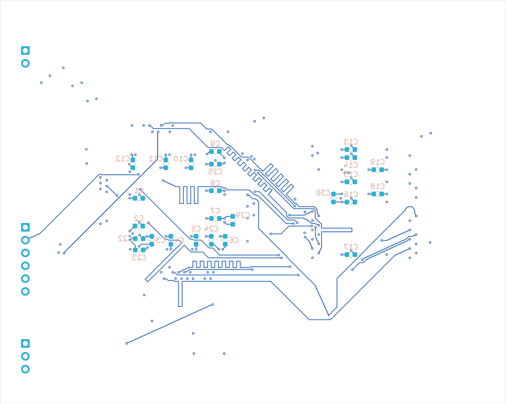

### Copper

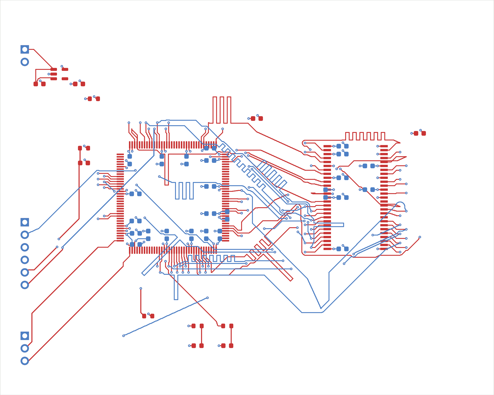

### Assembly

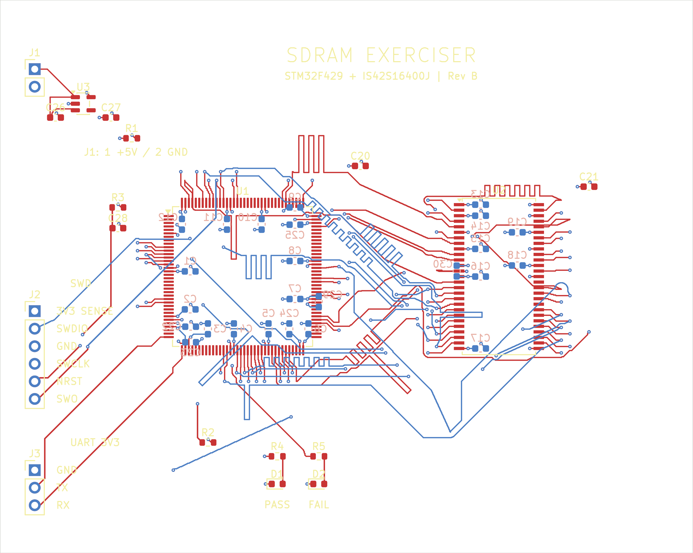

\newpage

## Copper Layers

### F.Cu

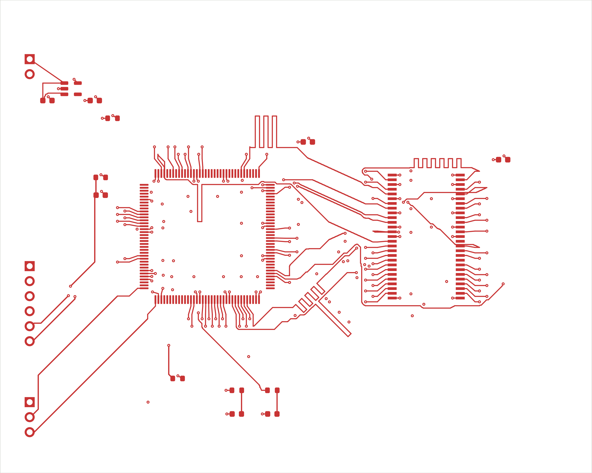

### In1.Cu

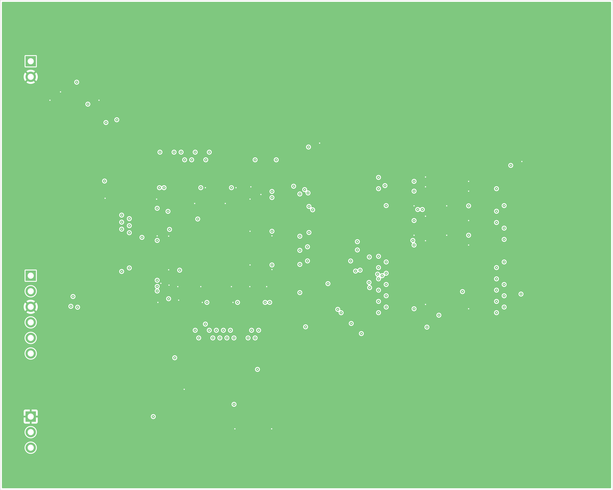

### In2.Cu

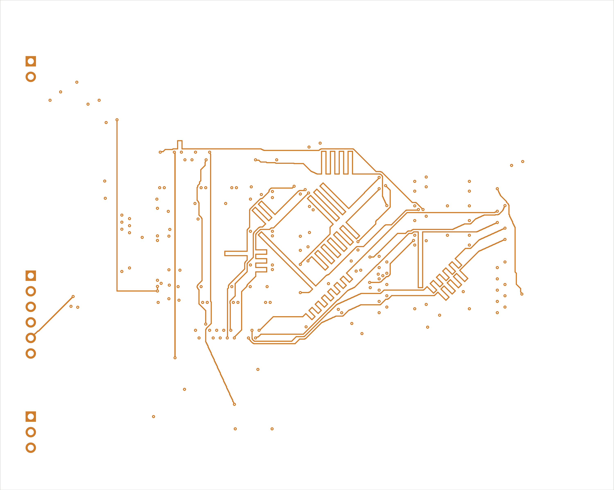

### In3.Cu

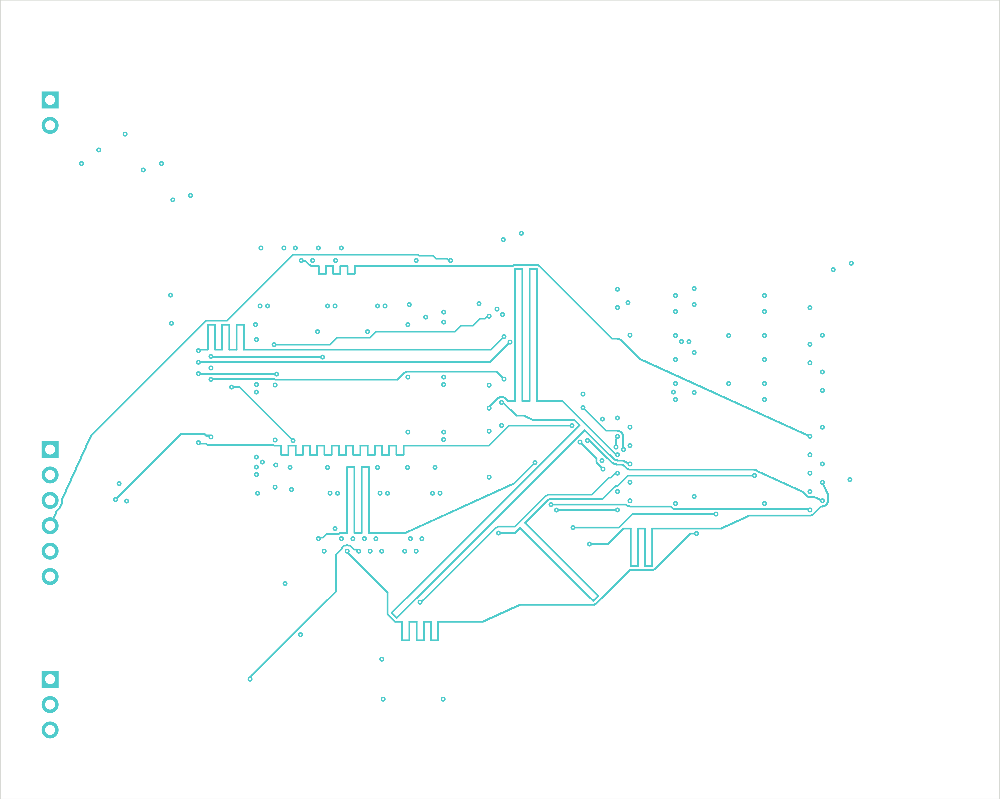

### In4.Cu

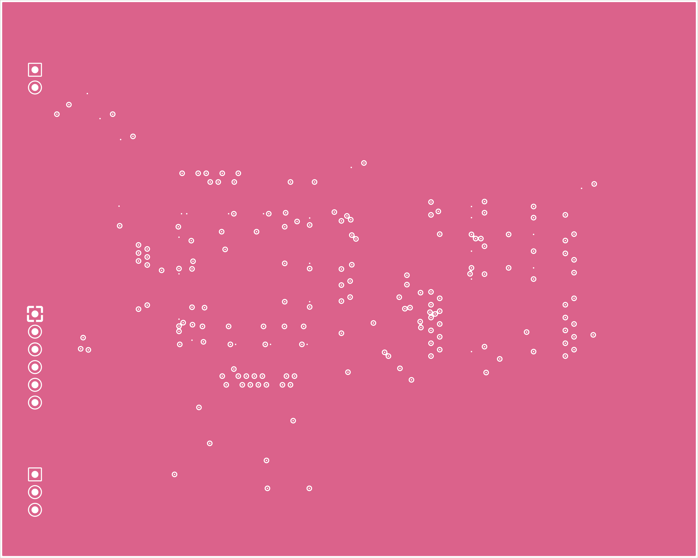

### B.Cu

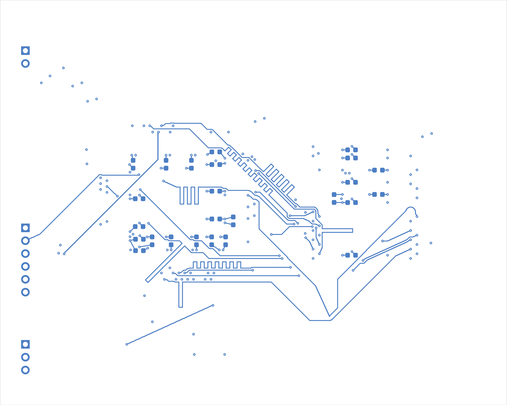

\newpage

## Bill of Materials

| Value | Package | Qty | References | LCSC |
|-------|---------|-----|------------|------|
| 100nF | C_0603_1608Metric | 21 | C1, C2, C3, C4, C5, C6, C7, C8, C9, C10 ... (+11 more) | C14663 |
| 10nF | C_0603_1608Metric | 2 | C29, C30 | C1589 |
| 10uF | C_0603_1608Metric | 2 | C26, C27 | C19702 |
| 1uF | C_0603_1608Metric | 1 | C23 | C15849 |
| 2.2uF | C_0603_1608Metric | 2 | C24, C25 | C23630 |
| 4.7uF | C_0603_1608Metric | 2 | C20, C21 | C1705 |
| GREEN | LED_0603_1608Metric | 1 | D1 | C125094 |
| RED | LED_0603_1608Metric | 1 | D2 | C94869 |
| 5V_INPUT | PinHeader_1x02_P2.54mm_Vertical | 1 | J1 | C124375 |
| SWD_3V3 | PinHeader_1x06_P2.54mm_Vertical | 1 | J2 | C37208 |
| UART_3V3 | PinHeader_1x03_P2.54mm_Vertical | 1 | J3 | C49257 |
| 0R | R_0603_1608Metric | 1 | R1 | C21189 |
| 10k | R_0603_1608Metric | 2 | R2, R3 | C25804 |
| 1k | R_0603_1608Metric | 2 | R4, R5 | C21190 |
| AP2112K-3.3TRG1 | SOT-23-5 | 1 | U3 | C51118 |
| IS42S16400J-6TLI-TR | TSOP-II-54_22.2x10.16mm_P0.8mm | 1 | U2 | C17216754 |
| STM32F429ZIT6 | LQFP-144_20x20mm_P0.5mm | 1 | U1 | C84808 |

\newpage

## DRC Status

| Metric | Count |
|--------|-------|
| Errors | 0 |
| Warnings | 0 |
| Blocking | 0 |

**Status**: PASS

\newpage

## Manufacturing Readiness

**Verdict**: READY

### Action Items

- **[OPTIONAL]** Verify zone fill in KiCad for 2 zone-connected nets

\newpage

## Routing Status

| Metric | Value |
|--------|-------|
| Signal Net Completion | 100.0% (53/53) |
| Overall Completion | 100.0% |
| Complete Nets | 55 / 55 |
| Zone-Connected Nets | 2 |
| Incomplete Nets | 0 |
| Unconnected Pads | 0 |

### Zone-Connected Nets

- +3V3
- GND

## Cost Estimate

| Metric | Per Board (estimated) |
|--------|-------|
| PCB Fabrication | ~5.0 USD |
| Components (estimated) | ~1.95 USD |
| Assembly (estimated) | ~2.43 USD |
| **Total (estimated)** | **~9.37 USD** |
| Batch Quantity | 5 |
| Batch Total (estimated) | ~46.87 USD |

