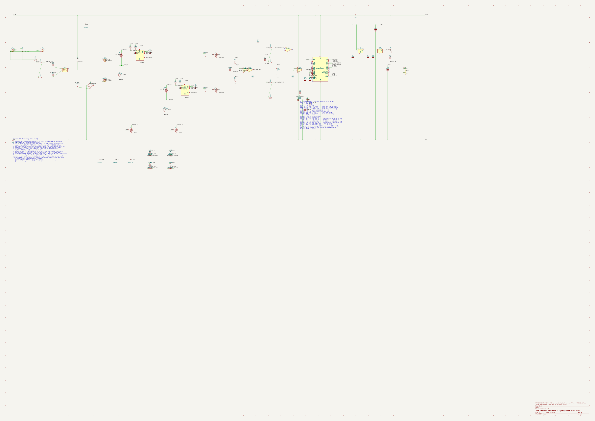
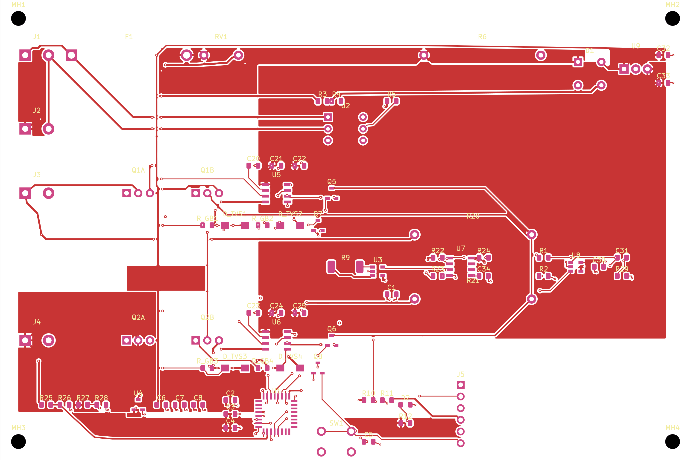
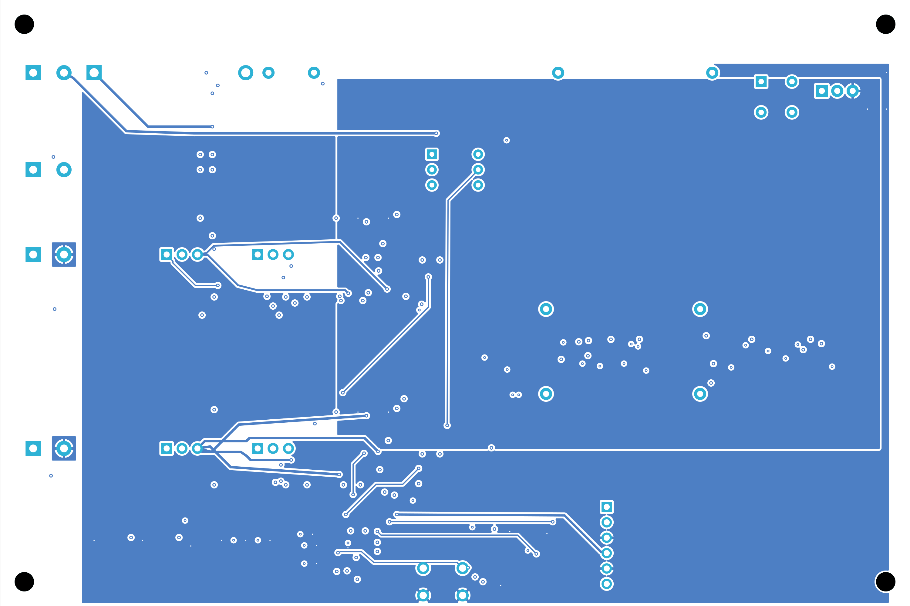
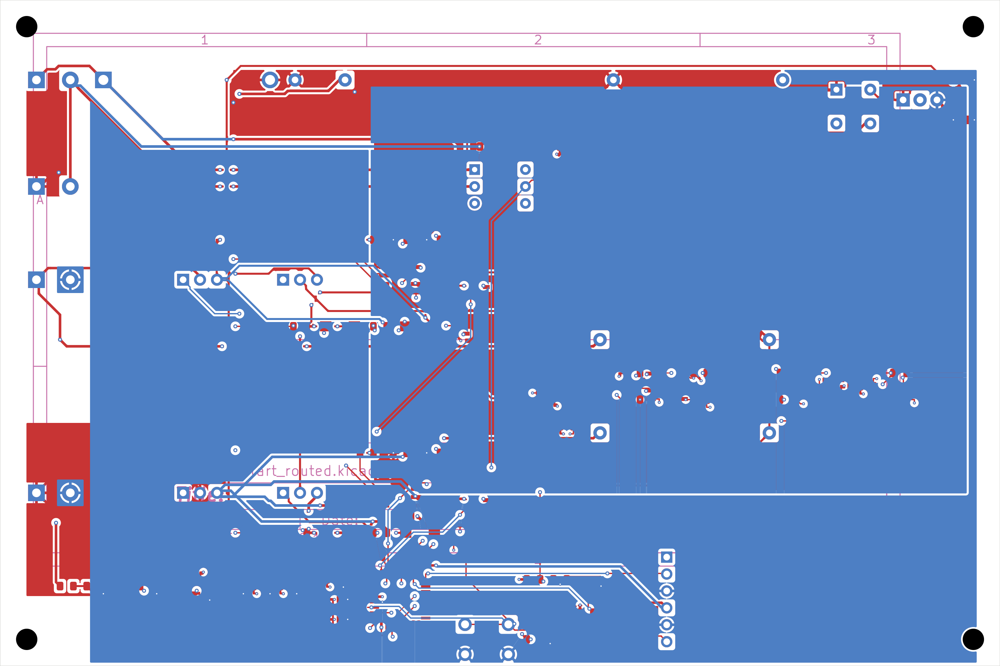
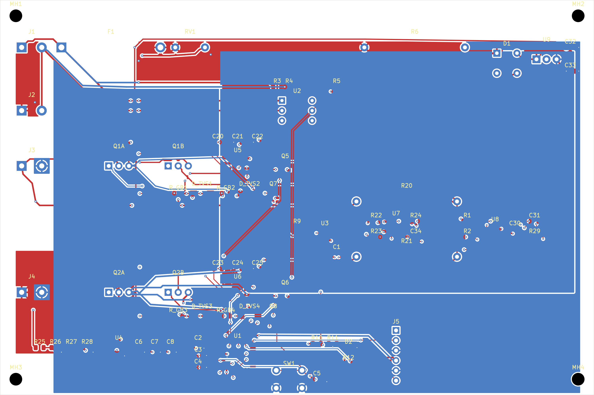
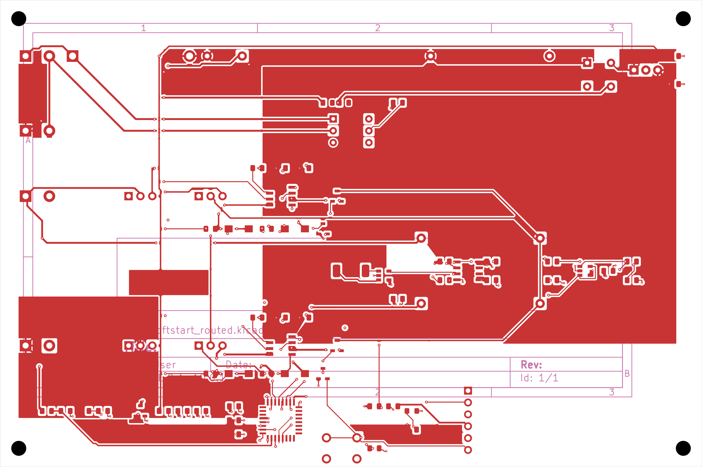
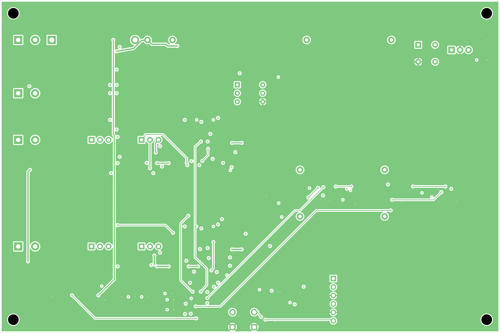
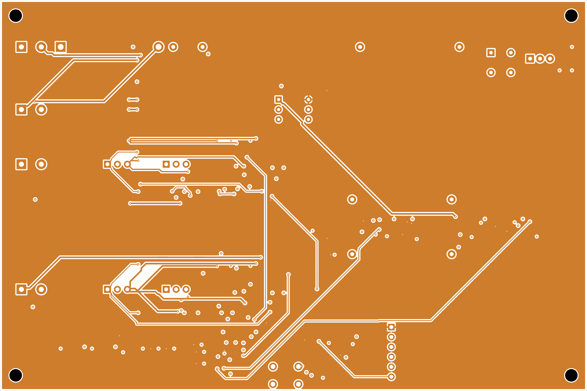
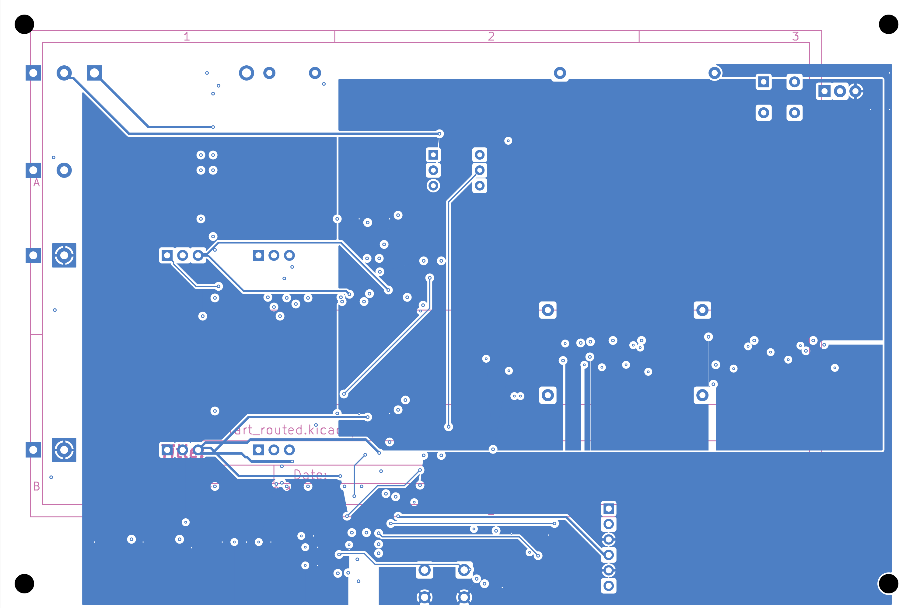

## Board Summary

| Property | Value |
|----------|-------|
| Layers | 4 copper (F.Cu, In1.Cu, In2.Cu, B.Cu) |
| Footprints | 78 (56 SMD, 18 THT, 4 other) |
| Nets | 41 |
| Traces | 4519 segments |
| Vias | 158 |
| Board Size | 150.0 x 100.0 mm |

## Design Overview

### Theory of Operation

Generator Soft-Start - Supercapacitor Power Assist

120VAC soft-start for 8000 BTU AC on Honda EU1000i

STM32G031K8T6 MCU, 2x30S supercap banks, back-to-back FETs + UCC27211 drivers

### Power Architecture

**Power Rails**: +3V3, GND, PWR_FLAG

| Regulator | Device |
|-----------|--------|
| U4 | XC6206-3.3V |
| U9 | LM7812 |

## Assembly Notes

1 fine-pitch component; 6 polarized components

- **Fine-pitch components**: 1 (U1)
- **Polarized components**: 6 -- check orientation markings

## Off-board Assemblies

The following subsystems are part of the design but are **not placed on
the PCB** -- they connect through board connectors and are assembled by
hand (DNP for fab assembly).

### SUPERCAP_BANK_POS

Positive half-cycle supercapacitor bank (off-board, 30S string)

| Property | Value |
|----------|-------|
| Board connector | J3 |
| Part | Tecate TPLH-2R7/12WR10X30 |
| Quantity | 30 |
| Voltage | 81V nominal |
| Capacitance | 0.4F |
| Assembly | hand solder (DNP for fab assembly) |

**Wiring**: J3 pin 1 -> SCAP_POS+ (bank positive terminal); J3 pin 2 -> SCAP_POS_GND (bank return, star ground). 30 cells in series, 12F 2.7V each.

### SUPERCAP_BANK_NEG

Negative half-cycle supercapacitor bank (off-board, 30S string)

| Property | Value |
|----------|-------|
| Board connector | J4 |
| Part | Tecate TPLH-2R7/12WR10X30 |
| Quantity | 30 |
| Voltage | 81V nominal |
| Capacitance | 0.4F |
| Assembly | hand solder (DNP for fab assembly) |

**Wiring**: J4 pin 1 -> SCAP_NEG+ (bank positive terminal); J4 pin 2 -> SCAP_NEG_GND (bank return, star ground). 30 cells in series, 12F 2.7V each.

## ERC Status

| Metric | Count |
|--------|-------|
| Errors | 0 |
| Warnings | 0 |

**Status**: SKIPPED -- ERC skipped by user request

\newpage

## Schematic Overview

### Schematic: softstart

\newpage

## PCB Layout

### Copper

### Assembly

\newpage

## Copper Layers

### F.Cu

### In1.Cu

### In2.Cu

### B.Cu

\newpage

## Bill of Materials

| Value | Package | Qty | References | MPN |
|-------|---------|-----|------------|-----|
| 100nF |  | 5 | C5, C20, C22, C23, C25 |  |
| 100nF | C_0402_1005Metric | 8 | C1, C2, C3, C8, C30, C31, C33, C34 |  |
| 10uF |  | 2 | C21, C24 |  |
| 10uF | C_0805_2012Metric | 3 | C6, C7, C32 |  |
| 4.7uF | C_0805_2012Metric | 1 | C4 |  |
| RB157 | Diode_Bridge_DIP-4_W7.62mm_P5.08mm | 1 | D1 |  |
| SMBJ18A | D_SMB | 4 | D_TVS1, D_TVS2, D_TVS3, D_TVS4 |  |
| STATUS |  | 1 | D2 |  |
| 15A |  | 1 | F1 |  |
| AC_INPUT | TerminalBlock_bornier-2_P5.08mm | 1 | J1 |  |
| AC_OUTPUT | TerminalBlock_bornier-2_P5.08mm | 1 | J2 |  |
| SCAP_NEG | TerminalBlock_bornier-2_P5.08mm | 1 | J4 |  |
| SCAP_POS | TerminalBlock_bornier-2_P5.08mm | 1 | J3 |  |
| SWD-6 |  | 1 | J5 |  |
| 2N7002 | SOT-23 | 2 | Q7, Q8 |  |
| AO3400 | SOT-23 | 2 | Q5, Q6 |  |
| IRFB4110 | TO-220-3_Vertical | 4 | Q1A, Q1B, Q2A, Q2B |  |
| 100R | R_Axial_DIN0617_L17.0mm_D6.0mm_P25.40mm_Horizontal | 2 | R20, R21 |  |
| 10k |  | 7 | R2, R10, R11, R23, R24, R26, R28 |  |
| 10k | R_0805_2012Metric | 6 | R_GB1, R_GB2, R_GB3, R_GB4, R5, R29 |  |
| 150R 5W | R_Axial_DIN0617_L17.0mm_D6.0mm_P25.40mm_Horizontal | 1 | R6 |  |
| 1k |  | 2 | R12, R22 |  |
| 275VAC | RV_Disc_D12mm_W4.2mm_P7.5mm | 1 | RV1 |  |
| 290.0k |  | 2 | R25, R27 |  |
| 33k | R_0805_2012Metric | 2 | R3, R4 |  |
| 5mR | R_2512_6332Metric | 1 | R9 |  |
| 990.0k |  | 1 | R1 |  |
| RESET |  | 1 | SW1 |  |
| H11AA1 | DIP-6_W7.62mm | 1 | U2 |  |
| INA180A3 | SOT-23-5 | 1 | U3 |  |
| LM393 | SOIC-8_3.9x4.9mm_P1.27mm | 3 | U7, U7, U7 |  |
| LM7812 | TO-220-3_Vertical | 1 | U9 |  |
| MCP6001 | SOT-23-5 | 1 | U8 |  |
| STM32G031K8T6 | LQFP-32_7x7mm_P0.8mm | 1 | U1 |  |
| UCC27211 | SOIC-8_3.9x4.9mm_P1.27mm | 2 | U5, U6 |  |
| XC6206-3.3V |  | 1 | U4 |  |
| Tecate TPLH-2R7/12WR10X30 | Off-board via J3 (hand solder, DNP for fab assembly) | 30 | SUPERCAP_BANK_POS | Tecate TPLH-2R7/12WR10X30 |
| Tecate TPLH-2R7/12WR10X30 | Off-board via J4 (hand solder, DNP for fab assembly) | 30 | SUPERCAP_BANK_NEG | Tecate TPLH-2R7/12WR10X30 |

\newpage

## DRC Status

| Metric | Count |
|--------|-------|
| Errors | 0 |
| Warnings | 0 |
| Blocking | 0 |

**Status**: PASS

\newpage

## Manufacturing Readiness

**Verdict**: READY

### Action Items

- **[OPTIONAL]** Verify zone fill in KiCad for 12 zone-connected nets
- **[OPTIONAL]** Analog-sensitive: U3 (INA180A3) — instrumentation amplifier (TI INA); manual layout review recommended
- **[OPTIONAL]** Analog net: AC_LINE — audio signal; keep short, away from digital/switching nets
- **[OPTIONAL]** Analog net: BUS_LINE — audio signal; keep short, away from digital/switching nets
- **[OPTIONAL]** Analog net: FUSED_LINE — audio signal; keep short, away from digital/switching nets
- **[OPTIONAL]** Analog net: ISENSE_NEG — analog signal; noise-sensitive, avoid crossing digital signals
- **[OPTIONAL]** Analog net: ISENSE_POS — analog signal; noise-sensitive, avoid crossing digital signals
- **[OPTIONAL]** Analog net: I_SENSE_OUT — analog signal; noise-sensitive, avoid crossing digital signals
- **[OPTIONAL]** Analog net: V_AC_SENSE — analog signal; noise-sensitive, avoid crossing digital signals
- **[OPTIONAL]** Analog net: V_AC_SENSE_RAW — analog signal; noise-sensitive, avoid crossing digital signals
- **[OPTIONAL]** Analog net: V_BANK_NEG_SENSE — analog signal; noise-sensitive, avoid crossing digital signals
- **[OPTIONAL]** Analog net: V_BANK_POS_SENSE — analog signal; noise-sensitive, avoid crossing digital signals

## Analog Components

1 analog-sensitive component detected -- manual layout review recommended.

| Reference | Value | Reason |
|-----------|-------|--------|
| U3 | INA180A3 | instrumentation amplifier (TI INA) |

\newpage

## Routing Status

| Metric | Value |
|--------|-------|
| Signal Net Completion | 100.0% (27/27) |
| Overall Completion | 100.0% |
| Complete Nets | 41 / 41 |
| Zone-Connected Nets | 14 |
| Single-Pad Nets | 2 (no routing needed) |
| Incomplete Nets | 0 |
| Unconnected Pads | 0 |

### Zone-Connected Nets

- +3.3V
- AC_LINE
- AC_NEUTRAL
- BUS_LINE
- FUSED_LINE
- GND
- SCAP_NEG+
- SCAP_NEG_GND
- SCAP_POS+
- SCAP_POS_GND
- SRC_NEG
- SRC_POS
- VGATE
- VRECT

### Single-Pad Nets

2 single-pad nets (no routing needed) -- not listed individually.

## Cost Estimate

| Metric | Per Board (estimated) |
|--------|-------|
| PCB Fabrication | ~5.0 USD |
| Components (estimated) | ~5.72 USD |
| Assembly (estimated) | ~0.0 USD |
| **Total (estimated)** | **~10.72 USD** |
| Batch Quantity | 5 |
| Batch Total (estimated) | ~53.6 USD |

